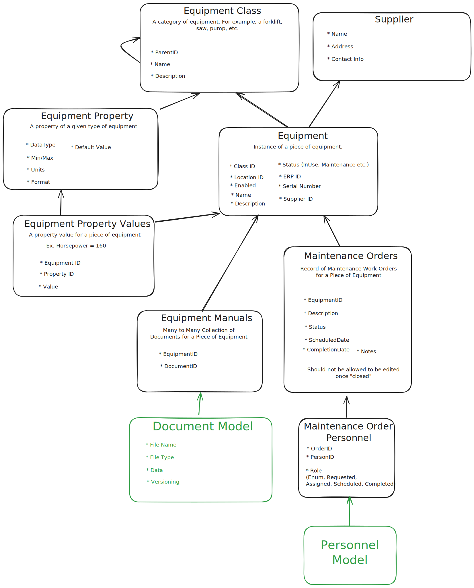

# Equipment Schema Overview

The **Equipment** schema in **TamakiMES** is designed to manage all aspects of physical assets within a manufacturing
environment. It enables tracking, categorizing, and maintaining equipment, ensuring that each piece is effectively
monitored and available for production activities.

## Core Components

- **Equipment Class**: Defines categories of equipment (e.g., Forklift, Pump), allowing similar types of equipment to be
  grouped for streamlined management, reporting, and scheduling. Equipment Classes also store common properties that
  apply to all equipment within that category.

- **Equipment**: Represents individual instances of equipment within the facility. Each equipment item is linked to an
  Equipment Class, inheriting standard properties, while also maintaining unique data specific to that item (e.g.,
  location, status). This provides a clear structure for managing both individual items and groups of similar assets.

- **Equipment Property**: Defines the attributes that are common across all items within an Equipment Class, such as "
  Horsepower" for motors or "Capacity" for tanks. This enables standardized property definitions for each category of
  equipment.

- **Equipment Property Value**: Stores specific values for each property at the individual equipment level, allowing
  customization per item. This ensures that each piece of equipment can be configured and tracked based on its unique
  specifications.

- **Supplier**: Stores information about the suppliers from whom equipment is sourced, helping in tracking the origin,
  support contacts, and other relevant supplier data.

- **Maintenance Orders**: Tracks maintenance tasks for equipment, including scheduling and status updates. Maintenance
  Orders help ensure that equipment remains in optimal condition, with logs for planned and completed maintenance
  activities.

- **Maintenance Plans**: Establishes recurring or triggered maintenance schedules for equipment, ensuring proactive
  upkeep. Maintenance Plans can automatically generate Maintenance Orders based on predefined triggers or schedules.

- **Document Model (Equipment Manuals)**: Provides storage for manuals and other documents associated with equipment.
  This supports easy access to technical information, with version control for tracking document updates.

## Summary

The Equipment schema in **TamakiMES** allows for comprehensive management of physical assets, from categorizing
equipment types to tracking individual items, maintenance, and documentation. This structure ensures that each piece of
equipment is accurately monitored, maintained, and documented, supporting operational efficiency and asset longevity.

---

This high-level overview provides a clear picture of how the **Equipment** schema functions within TamakiMES, without
delving into field-level details. Each component has a specific purpose, contributing to a complete and organized asset
management system.