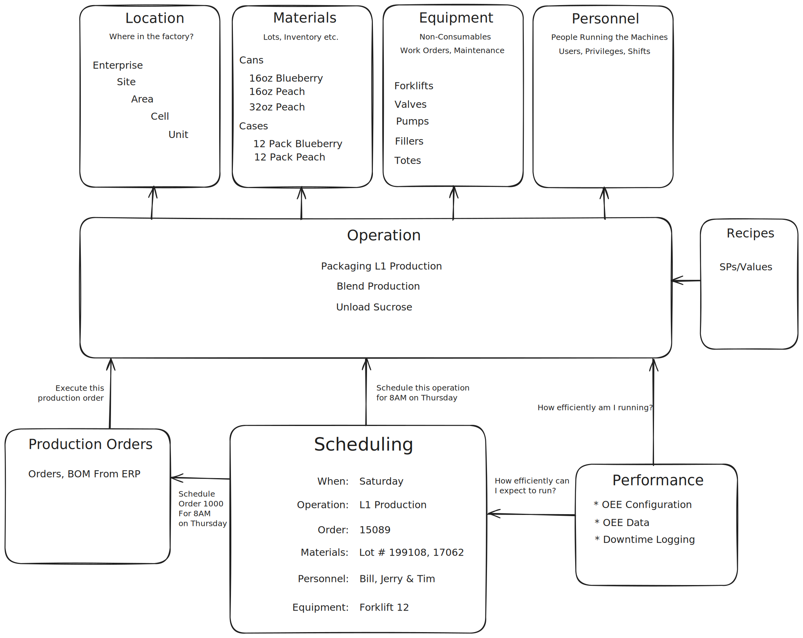

# TamakiMES Data Model Introduction

This document provides an overview of the data model used in **TamakiMES**. The model is designed to track and manage
key entities involved in manufacturing operations, supporting functions like **OEE (Operational Equipment Effectiveness)
**, yield and lot tracing, inventory tracking, and production scheduling.

## Core Modules and Their Relationships

1. **Location**  
   Defines where an operation or equipment is located within the factory. The hierarchy includes:
   - **Enterprise**: The top level, representing the entire organization.
   - **Site**: Represents different factory sites.
   - **Area**: Subdivisions within a site, like departments.
   - **Cell**: Smaller areas within an area, such as production cells.
   - **Unit**: The smallest functional unit within a cell.

   Each piece of equipment or operation is associated with a specific location to provide a clear context for production
   tracking.

2. **Materials**  
   Manages the tracking of lots, inventory, and materials in various formats:
   - **Cans**: Individual units like 16oz or 32oz cans.
   - **Cases**: Bundled units like 12-pack cases.

   Materials are linked to operations, enabling tracking of inventory usage, lot tracing, and yield calculation.

3. **Equipment**  
   Includes non-consumable assets like forklifts, valves, pumps, fillers, and totes. This module supports:
   - **Work Orders**: Maintenance and repair orders.
   - **Maintenance Tracking**: Ensures equipment is operational and logs downtime.

   Equipment is assigned to specific operations and locations, contributing to OEE and performance tracking.

4. **Personnel**  
   Contains information about the people operating the equipment and running the machines. This includes:
   - **Users and Privileges**: Access controls for operators, supervisors, and other roles.
   - **Shift Assignments (Shifts)**: Assigns personnel to operations based on shifts.

   Personnel can be associated with operations and scheduling, ensuring appropriate staffing.

5. **Recipes**  
   Manages standard parameters (SPs) and values for operations. Recipes define how products should be processed in
   specific operations, ensuring consistency and quality control.

6. **Operation**  
   Represents the primary production tasks, such as:
   - **Packaging L1 Production**
   - **Blend Production**
   - **Unload Sucrose**

   Operations are central to the system and interact with most other modules, including:
   - **Materials**: For tracking input and output.
   - **Equipment and Personnel**: For associating resources and workforce.
   - **Production Orders and Scheduling**: To execute and manage tasks based on production demands.
   - **Performance**: To measure efficiency and output quality.

7. **Production Orders**  
   Tracks orders and Bill of Materials (BOM) data from an ERP system. Production orders:
   - Schedule and execute specific operations.
   - Define which materials and recipes to use for production tasks.

   Orders are essential for planning and are linked to scheduling, ensuring operations align with production goals.

8. **Scheduling**  
   Specifies when an operation should occur, detailing:
   - **Date and Time**: Such as “8 AM on Thursday” for specific operations.
   - **Order**: Links to production orders.
   - **Materials, Personnel, and Equipment**: Allocates necessary resources to meet production schedules.

   Scheduling ensures that resources, orders, and personnel align with production timelines and goals.

9. **Performance**  
   Tracks Operational Equipment Effectiveness (OEE) and logs downtime:
   - **OEE Data**: Monitors how efficiently the equipment and operations run.
   - **Downtime Logging**: Records any time equipment is non-operational, impacting productivity.

   The performance data helps in evaluating and improving the efficiency of operations and scheduling.

---

Each module plays a specific role in the overall MES framework, enabling **TamakiMES** to provide comprehensive,
real-time insights into production performance, inventory management, and operational efficiency. The **common object
model** underpins this structure, ensuring consistency and traceability across all records.

## Common Object Model

The **common object model** defines a set of base entities that standardize core fields, provide auditing capabilities,
and offer flexible, reusable components across the schema. This is primarily achieved through the `BaseEntity` class.

### BaseEntity Class

The `BaseEntity` class serves as the foundation for all major entities in TamakiMES, providing essential fields and
functions such as:

- **ULID Identifiers**: Each entity instance uses a unique, **Universally Unique Lexicographically Sortable Identifier (
  ULID)** as its primary key. ULIDs ensure consistency and traceability, especially in distributed systems, as they are
  both unique and ordered by time.
   - ULIDs in TamakiMES can also have their cardinality adjusted to include a hash of a “parent” entity, allowing
     hierarchical relationships.

- **Audit Fields**: The `BaseEntity` class includes standard fields for tracking creation and modification events:
   - `createdDate` and `createdBy`: Automatically populated when a record is created.
   - `modifiedDate` and `modifiedBy`: Updated when a record is modified, enabling traceability of changes.
   - **Custom Notes and Spare Fields**: Three `spare` fields (`spare1`, `spare2`, and `spare3`) are provided as
     optional text fields. These can be customized by users for additional context or metadata as needed.

- **Status and Metadata**:
   - `enabled`: A Boolean field indicating if the entity is active.
   - `notes`: Stores general information related to the entity, supporting more detailed context.

### ULID Generator

The `ULID` generator is implemented as a custom identifier generator in Java. This generator creates ULIDs that are
unique across distributed systems and lexicographically sortable, which is ideal for systems that log events or need
consistent ordering by creation time. The generator:

- **Combines timestamp and randomness** to ensure uniqueness.
- **Supports prefixing** with a custom value, which can be derived from a parent entity, adding flexibility in
  hierarchies.

The generator uses **Crockford’s Base32 encoding** for encoding the timestamp and random segments, providing compact,
sortable identifiers.

### How Audit Fields Are Populated

The audit fields—`createdBy`, `createdDate`, `modifiedBy`, and `modifiedDate`—are handled automatically within the
common object model. They:

- Capture the current system user and timestamp at the time of creation or modification.
- Ensure every entity maintains a history of who made changes and when, supporting compliance and auditing.

---

## Modular Structure and Interactions

TamakiMES is structured into interconnected modules, each handling a specific aspect of manufacturing operations. Below
is a high-level view of the different modules and how they interact:

1. **Operations Module**: Manages production and material operations, including yield tracking and lot tracing. This
   module interfaces with:
   - **Inventory Module** to update inventory levels based on production or material consumption.
   - **OEE Module** to record performance data and calculate effectiveness based on equipment usage.

2. **OEE Module**: Tracks equipment performance and provides OEE calculations. It integrates with:
   - **Equipment Management** to gather data on equipment utilization and downtime.
   - **QA Module** to analyze quality issues that may impact OEE scores.

3. **QA Module**: Records quality checks and tracks compliance data. It interacts with:
   - **Inventory Module** to link QA data to specific lots and inventory items.
   - **Operations Module** for auditing production steps and quality events.

4. **Inventory Module**: Manages inventory levels and materials within the plant. It interacts with:
   - **Operations Module** to track material consumption and production output.
   - **QA Module** for quality control on incoming and outgoing materials.

---

This structure allows TamakiMES to maintain clear boundaries between functional domains while ensuring a cohesive flow
of data. Each module communicates through well-defined interfaces, leveraging the common object model for consistency
across records and facilitating easy integration with external systems.

---

This high-level structure gives users an understanding of how different areas of TamakiMES interact and how the **common
object model** underpins key functionality and consistency across the system.