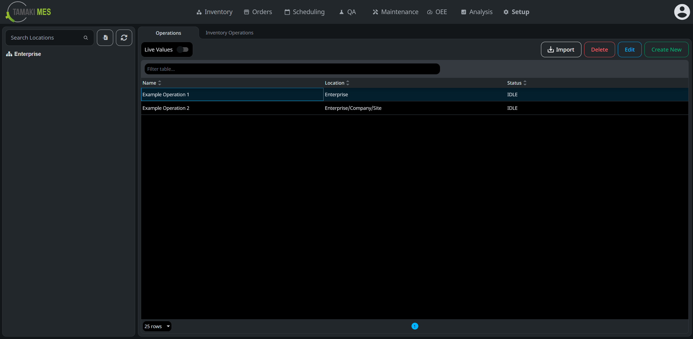
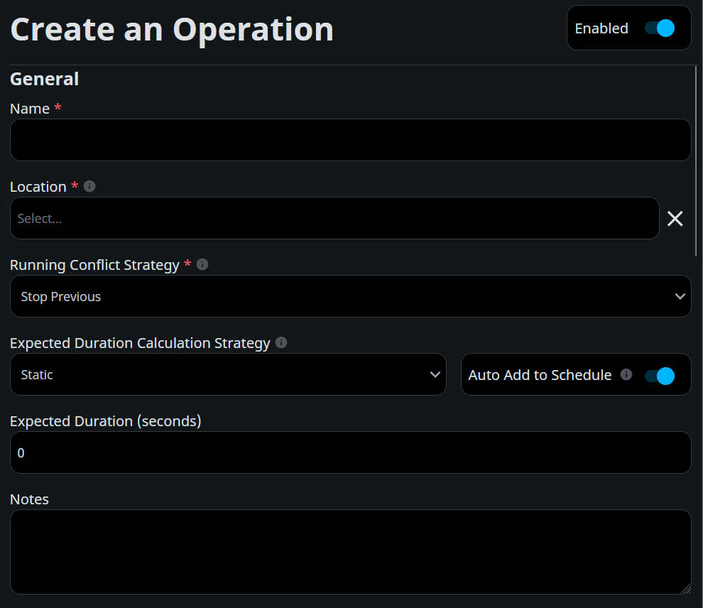
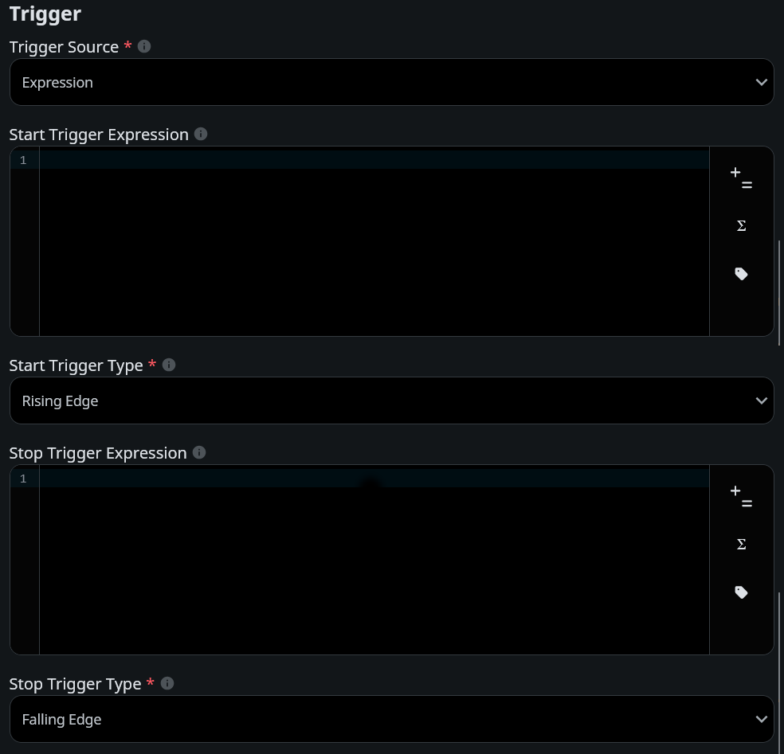
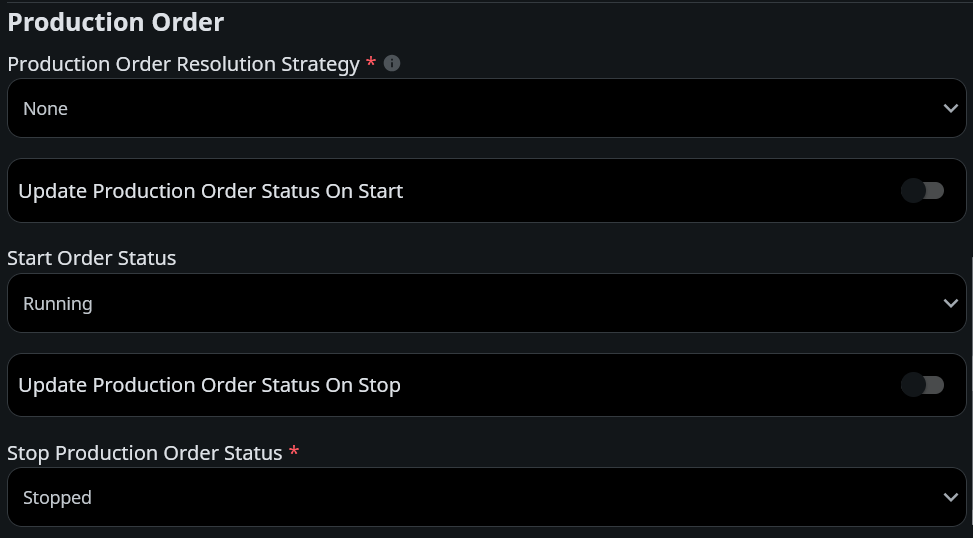

# Operation User Guide

An operation is an action that can be performed in the MES system to achieve a particular manufacturing step.

## Operation Configuration Screen

To navigate to the operation configuration screen, go to the MES Perspective project and select `Setup` → `Operations`
from the navigation menu at the top of the screen.

The main view of the operations configuration screen displays a table listing all existing operations, including their 
names, locations, and current status. In the top right corner of the table are buttons for creating, editing, and 
deleting operations, as well as a button for importing operations from a CSV or JSON file. A search bar at the top of 
the table enables quick filtering of operations by name or other attributes.

On the left side of the screen is a sidebar that contains the location tree. Selecting a location filters the operations
shown in the table. Tree nodes can be expanded and collapsed, and the search bar can be used to locate specific 
locations.

## Creating an Operation

To create a new operation, click the `Create New` button in the top right corner of the operations table. This will
open the Create an Operation dialog. This dialog has three sections: General, Trigger, and Production Order. Once the
fields in these sections are filled out, click the `Confirm` button at the bottom of the view.

### General

This section is for setting the basic information about the operation.

- **Name**: The name of the operation. This is a required field and must be unique.
- **Location**: The location where the operation will take place. This is a required field. A location must be selected
from the dropdown menu or selected on the Operation Configuration Screen before clicking the `Create New` button.
- **Running Conflict Strategy**: Defines the behavior when an operation is started while another instance of the same 
operation is already running.
    - **Throw Exception**: Throws an exception and does not start the new instance of the operation.
    - **Stop Previous**: Stops the currently running instance of the operation and starts a new one.
- **Expected Duration Calculation Strategy**: How the expected duration of the operation is calculated.
    - **Static**: The expected duration is a fixed value entered in the Expected Duration field.
    - **Expression**: The expected duration is calculated at runtime using an expression entered in the Expected 
  Duration Expression field.
    - **From Production Order**: The expected duration is taken from the production order associated with the operation.
- **Notes**: Any additional notes or comments about the operation.

### Trigger
This section is for configuring the conditions that start and stop the operation.

- **Trigger Source**: What triggers the operation to start and stop.
  - **Manual**: The operation is triggered by an API call. See 
  [Start Operation](../../appendix/script-api/operation-script-api/start-operation.md) and 
  [Stop Operation](../../appendix/script-api/operation-script-api/stop-operation.md) for more information.
  - **Expression**: The operation is triggered by start and stop expressions, which are evaluated at regular intervals. 
  When an expression evaluates to its trigger value, the operation will start or stop accordingly.
- **Start and Stop Trigger Expressions**: The expressions that trigger the operation to start or stop. These fields are 
required if the trigger source is set to `Expression`. Each must evaluate to a boolean or numeric value. Numeric values 
are interpreted as false if they are 0 and true if they are any other number.
- **Start and Stop Trigger Types**: How changes in the trigger expressions are used to start or stop the operation.
  - **Rising Edge**: The operation will start or stop when the trigger expression changes from false to true.
  - **Falling Edge**: The operation will start or stop when the trigger expression changes from true to false.
  - **Any Change**: The operation will start or stop whenever the trigger expression changes value.

### Production Order
This section is for setting how the operation interacts with production orders.

- **Production Order Resolution Strategy**: How the production order associated with this operation is determined.
  - **None**: No production order.
  - **Manual**: The production order is specified when starting the operation via an API call. See 
  [Start Operation](../../appendix/script-api/operation-script-api/start-operation.md) for more information.
  - **Expression**: The production order is determined by evaluating an expression when the operation starts.
  - **Schedule**: The production order is specified by the schedule that starts the operation.
- **Production Order Update Strategy**: Defines the behavior if the production order expression evaluation changes while 
the operation is running.
  - **Keep First Good Value**: The production order is set to the first valid value returned by the expression and does 
  not change.
  - **Keep Last Good Value**: While the operation is running, the production order is updated to the most recent valid 
  value returned by the expression.
  - **Throw Error**: If the expression returns a different valid value than the current production order while the 
  operation is running, an exception will be thrown.
  - **New Record**: If the expression returns a different valid value than the current production order while the 
  operation is running, the system will try to start a new instance of the operation with the new production order.
- **Production Order Expression**: The expression that determines the production order associated with this operation. 
This field is required if the production order resolution strategy is set to `Expression`. The expression must evaluate 
to a string that is a valid production order name or ID.
- **Update Production Order Status On Start**: Indicates whether the status of the production order is updated when the 
operation starts
- **Start Order Status**: The value to set the production order status when the operation starts.
- **Update Production Order Status On Stop**: Indicates whether the status of the production order is updated when the 
operation stops.
- **Stop Order Status**: The value to set the production order status when the operation stops.

