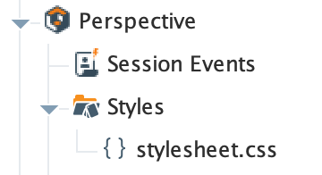

## Overview

This project contains a custom CSS stylesheet that is organized into two main sections: the base Perspective theme and custom utility classes. The base theme is a modified version of the default Perspective light-cool theme that ships with Ignition. Our version of the theme includes a few tweaks to improve the overall look and feel of the project, as well as fixing some bugs and inconsistencies in the default theme. Additionally it provides true (OS-based) dark mode support that is supported by our custom Theme Changer component (included in the header of the project).

**Important**: The custom theme will only be applied if the Perspective theme is set to empty in Designer.

The custom utility classes are a collection of CSS classes that can be used to style components and screens in a consistent way.

## Modifying the Stylesheet

To modify the stylesheet, simply open the `Styles/stylesheet.css` file in the Designer. The stylesheet is organized into two main sections: the base theme and the utility classes. The base theme is at the top of the file, and the utility classes are at the bottom. The classes are organized into sections similar to this documentation page, so you can easily find the class you want to edit.

