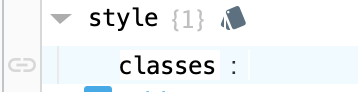

## Overview

As a part of the Perspective project, we have created a collection of utility classes that can be used to style components and screens in a very fast and consistent way.

## Usage

To use the utility classes, simply add the desired class to the `style.classes` property of the component you want to style. For example, to add a border to a component, you can add the `border` class to the `style.classes` property.

```json
{
	"style.classes": "border"
}
```



## Editing the Utility Classes

The utility classes are defined in the second half of the custom stylesheet. To edit them, simply open the stylesheet in the Designer and scroll down to the `Utility Classes` section. The classes are organized into sections similar to this documentation page, so you can easily find the class you want to edit.

**Important**: In the stylesheet, all custom classes to be used in perspective must start with the `psc` prefix. This is to avoid conflicts with any default classes that may be added in future versions of Perspective. However, the `psc` prefix is not required when adding the class to the `style.classes` property of a component.

If you make changes to the stylesheet, you will need to save the stylesheet and refresh the Designer (or close/reopen each view) to see the changes take effect.
