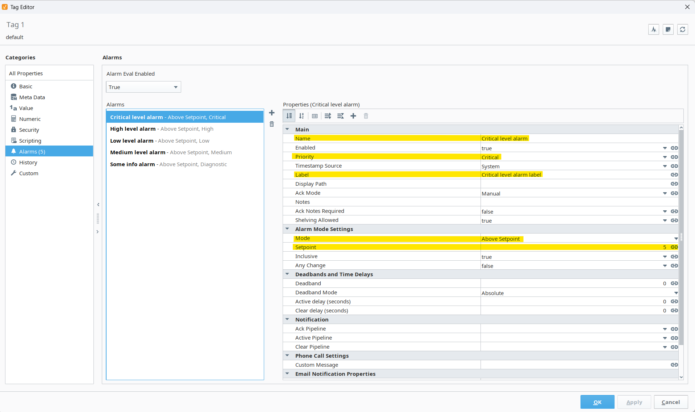

# Alarm Integration

**Example:**

**Description:**

- Alarms in Tamaki MES are directly integrated with the Ignition Tag Alarm System.
- This means alarms must be configured in Ignition - Tamaki MES does not create or manage alarm definitions itself.
- Once alarms are configured and active, Tamaki automatically listens for Alarm Events and displays them on the Alarm Status Page within the MES interface.

---

## Configuring Alarms in Ignition

To define alarms that Tamaki will capture, configure them directly in the **Ignition Tag Editor**.

The image above shows a typical setup in Ignition where multiple alarms are defined on a single tag, such as:

- **Critical level alarm**
- **High level alarm**
- **Low level alarm**
- **Medium level alarm**
- **Info level alarm**

Each alarm has configurable properties such as:

- **Name:** The name of the alarm.
- **Enabled:** Determines if the alarm is currently active.
- **Priority:** Defines the importance (Critical, High, Medium, Low, Diagnostic).
- **Label / Display Path:** Optional descriptive text for easier identification.
- **Mode:** Defines the condition (e.g., Above Setpoint, Below Setpoint).
- **Setpoint:** The value threshold for triggering the alarm.

For complete details on all alarm properties, refer to the official Ignition documentation:  
[**Tag Alarm Properties (Ignition Docs)**](https://www.docs.inductiveautomation.com/docs/8.1/platform/tags/tag-properties/tag-alarm-properties)

---

## How Alarm Events Are Captured

Tamaki MES automatically listens for alarm state changes from the configured Ignition tag paths.  
It captures each alarm event as it occurs and records it in the database.

| Alarm Event Type            | Description                                                                                                        |
| --------------------------- | ------------------------------------------------------------------------------------------------------------------ |
| **Active, Unacknowledged**  | Triggered when the tag value meets or exceeds the alarm condition.                                                 |
| **Active, Acknowledged**    | Triggered when the tag value meets or exceeds the alarm condition and has been acknowledged by a user.             |
| **Cleared, Unacknowledged** | Logged when the tag value returns to a normal state below the alarm condition.                                     |
| **Cleared, Acknowledged**   | Logged when the tag value returns to a normal state below the alarm condition and has been acknowledged by a user. |

Tamaki only records event transitions (Active and Cleared), not continuous durations.

---

## Creating Alarms in Tamaki MES

When setting the tag path as shown above, you can specify a tag folder to receive notifications for all tags within that folder, including any nested subfolders. Selecting a top-level folder will generate notifications for every tag in its folder hierarchy.

---

## Viewing Alarms in Tamaki MES

After configuration, all alarm events appear on the Alarm Status Page in Tamaki MES.  
This view provides a wide range of filtering and sorting options, including by priority, state, and time.