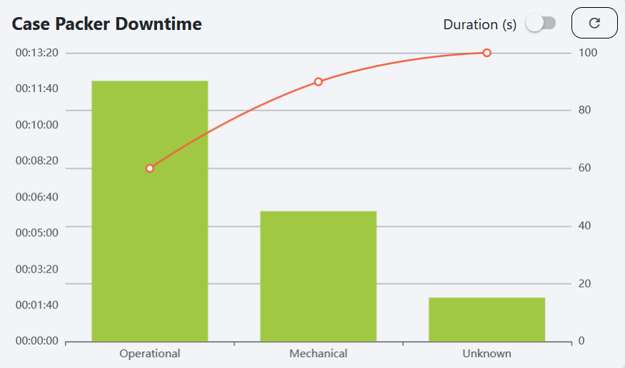

# Downtime Pareto Widget

The downtime pareto widget displays a [Pareto chart](https://en.wikipedia.org/wiki/Pareto_chart) of downtime events 
that have occurred recently for a specified location and downtime reason. A Pareto chart is a type of chart that 
contains both bars and a line graph.

## Parameters
- **Name**: The name of the widget instance.
- **Title**: The title displayed at the top of the chart.
- **Location**: The location to display downtime events for. 
- **Downtime Reason**: The downtime reason parent to display events for.
- **Duration**: The range of time shown on the chart. A duration of 6 hours will show downtime events from the last 6 
hours, for example.
- **Refresh Interval**: How often the widget refreshes its data.

