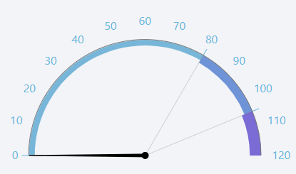

# Gauge Widget

The gauge widget displays a numeric value on a circular gauge. It is commonly used to represent values such as speed, 
temperature, or pressure. This widget utilizes the 
[Perspective Gauge component](https://www.docs.inductiveautomation.com/docs/8.1/appendix/components/perspective-components/perspective-chart-palette/perspective-gauge).

## Parameters
- **Name**: The name of the widget instance.
- **Tag**: The path of the tag to be displayed on the gauge. This should be a numeric tag. Clicking the tag icon will open
a tag browser to select the desired tag.
- **Start Angle**: The starting angle of the gauge arc in degrees. For example, a start angle of 180 degrees will 
position the start of the arc at the left side of the gauge.
- **End Angle**: The ending angle of the gauge arc in degrees. For example, an end angle of 360 degrees will position 
the end of the arc at the right of the gauge
- **Outer Axis**: A Json object defining the styling of the outer axis of the gauge.
- **Animate**: Toggle to enable or disable animation when the gauge value changes. When enabled, the needle will 
smoothly move to the new value. When disabled, the needle will jump directly to the new value.
- **Reverse Scale**: Toggle to reverse the direction of the gauge scale.