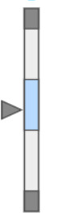

# Moving Analog Indicator Widget

The moving analog indicator widget displays the value of a numeric tag on a linear gauge.
Additionally, a sparkline chart can be enabled as part of the widget to show recent historical data for the tag.
It utilizes the
[Perspective Moving Analog Indicator component](https://www.docs.inductiveautomation.com/docs/8.1/appendix/components/perspective-components/perspective-display-palette/perspective-moving-analog-indicator)
and the 
[Perspective Sparkline component](https://www.docs.inductiveautomation.com/docs/8.1/appendix/components/perspective-components/perspective-display-palette/perspective-sparkline).

## Parameters
- **Name**: The name of the widget instance.    
- **Tag**: The path of the tag to be displayed on the moving analog indicator. This should be a numeric tag. Clicking the tag icon will open
a tag browser to select the desired tag.
- **Min Value**: The minimum value of the gauge scale. 
- **Max Value**: The maximum value of the gauge scale.
- **Desired Low**: The value at which the "desired" color range starts.
- **Desired High**: The value at which the "desired" color range ends.
- **Range**: How many minutes of historical data are shown on the sparkline chart. A time range of 5 minutes will show 
data from the last 5 minutes. 
- **Show Sparkline**: Toggle to enable or disable the sparkline chart.
