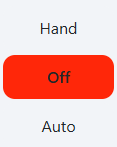

# Multi-State Button Widget

The multi-state button widget is a set of 2 or more buttons arranged in a column or row. Each button represents an
integer-valued state. When one of the buttons is pressed, its corresponding value will be written to the configured
tag. Only one button can be active at a time. This widget utilizes the 
[Perspective Multi-State Button component](https://www.docs.inductiveautomation.com/docs/8.1/appendix/components/perspective-components/perspective-input-palette/perspective-multistate-button).

## Parameters
- **Name**: The name of the widget instance.
- **Tag**: The path of the tag to be controlled by the multi-state button. This should be an integer tag.
- **Button States**: A Json list defining the buttons' labels, stying, and state values. The list should contain an object
for each button that contains `text`, `value`, `selectedStyle`, and `unselectedStyle`. 
- **Button Orientation**: The orientation of the buttons, either Column or Row.

