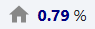

# Numeric Display Widget

The numeric display widget shows the value of a numeric tag.

## Parameters

- **Name**: The name of the widget instance.
- **Tag**: The path of the tag to be displayed on the numeric display. This should be a numeric tag. Clicking the tag icon will open
 a tag browser to select the desired tag.
- **Number Format**: The format in which to display the numeric value. Follows Java's 
[DecimalFormat](https://docs.oracle.com/javase/8/docs/api/java/text/DecimalFormat.html) patterns.
- **Units**: The units to display alongside the numeric value.
- **Value Color**: The color of the numeric value text.
- **Show Icon**: Toggle to enable or disable displaying an icon next to the numeric value.
- **Icon**: The path to the icon that will be displayed for the widget in the widget list. Click the search icon to
  open the icon picker dialog.