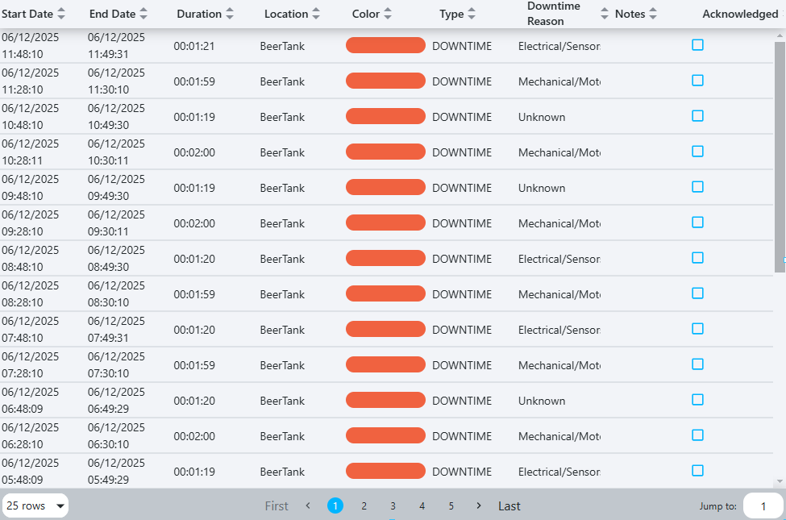

# OEE Downtime Table Widget

The OEE downtime table widget displays a table of recent downtime events for a specified location and downtime reason.

## Parameters
- **Name**: The name of the widget instance.
- **Location**: The location to display downtime events for.
- **Duration**: The range of time shown in the table. A duration of 6 hours will show downtime events from the last 6 
hours, for example.
- **Refresh Interval**: How often the widget refreshes its data.
- **Downtime Reason**: The downtime reason to display events for.
- **Microstop Threshold**: The minimum duration for a downtime event to be included in the table. Downtime events shorter than
this threshold will be excluded.
- **Microstop Threshold Units**: The units for the microstop threshold.