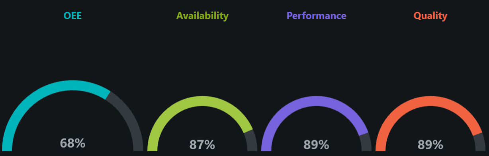

# OEE Gauges Widget

The OEE gauges widget displays circular gauges for recent Overall Equipment Effectiveness (OEE) and its three 
components, Availability, Performance, and Quality, for a specified location.

<!-- TODO get better picture of the OEE gauges widget after the formatting is fixed-->

## Parameters
- **Name**: The name of the widget instance.
- **Location**: The location to display OEE data for.
- **Duration**: The range of time used to calculate the OEE and its components. A duration of 6 hours will calculate
OEE based on data from the last 6 hours, for example.
- **Refresh Interval**: How often the widget refreshes its data.

