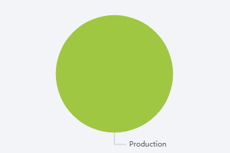

# OEE Mode Pie Chart Widget

The OEE mode pie chart widget displays a pie chart of the different modes that have occurred recently for a specified
location.

<!-- TODO replace with better screenshot showing more than just Production mode-->

## Parameters
- **Name**: The name of the widget instance.
- **Title**: The title displayed at the top of the chart.
- **Location**: The location to display mode data for.
- **Duration**: The range of time shown on the chart. A duration of 6 hours will show modes from the last 6 hours, for example.
- **Refresh Interval**: How often the widget refreshes its data.
- **Tooltip Formatter**: <!-- TODO description of the tooltip formatter parameter -->
