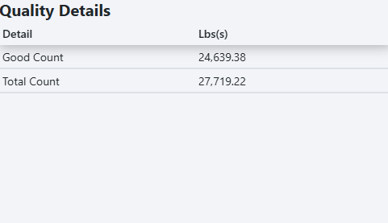

# OEE Quality Table Widget

The OEE quality table widget displays the good count and total count for a specified location over a recent time period. 

## Parameters
- **Name**: The name of the widget instance.
- **Title**: The title displayed at the top of the table.
- **Location**: The location to display quality data for.
- **Duration**: The range of time used to calculate the quality metrics. A duration of 6 hours will calculate
quality based on data from the last 6 hours, for example.
- **Refresh Interval**: How often the widget refreshes its data.

