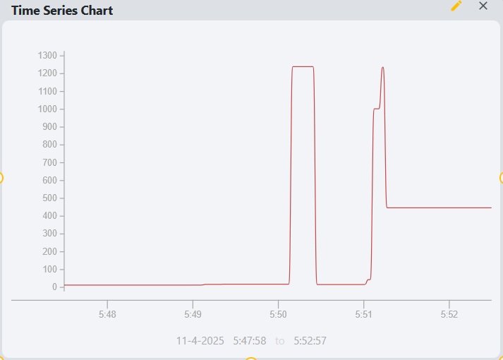

## Time Series Chart Widget

The time series chart widget displays recent historical tag data on a graph. It utilizes the 
[Perspective Time Series Chart component](https://www.docs.inductiveautomation.com/docs/8.1/appendix/components/perspective-components/perspective-chart-palette/perspective-time-series-chart).

### Parameters
- **Name**: The name of the widget instance.
- **Title**: The title displayed at the top of the chart.
- **Tag**: The path of the tag to be displayed on the chart. This should be a numeric tag with historization enabled. 
Clicking the tag icon will open a tag browser to select the desired tag.
- **Chart Type**: The type of chart to display. Options include Line, Area, Bar, and Scatter.
- **Range**: How many minutes of historical data are shown on the chart. A time range of 5 minutes will show data from 
the last 5 minutes, for example.
- **Poll**: Toggle to enable or disable automatic polling for new data.
- **Poll Rate**: The frequency in seconds at which the chart updates with new data. 
- **Y-Axis Auto Range**: Toggle to enable or disable automatic scaling of the Y-axis based on the data range.
- **Pen Color**: The color of the line or area representing the tag data on the chart.

