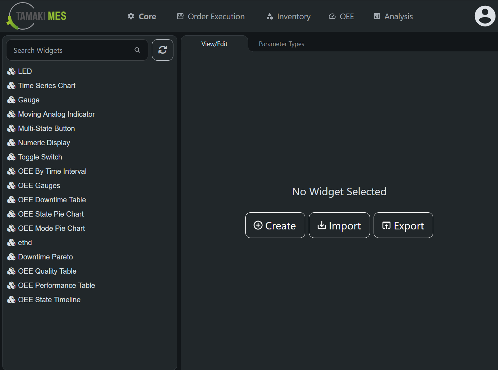

# Widgets User Guide

Widgets are individual components that can be added to [custom dashboards](dashboard.md) to display or control live 
data in various formats. Under the hood, a widget can be any ignition perspective view. Tamaki MES provides a set of 
pre-configured widgets to be used out-of-the-box, but users can also create their own custom widgets.

## Pre-Configured Widgets

### Charts
- [Time Series Chart](./preconfigured-widgets/time-series-chart.md)

### Controls
- [Multi-State Button](./preconfigured-widgets/multi-state-button.md)
- [Toggle Switch](./preconfigured-widgets/toggle-switch.md)

### Display 
- [Gauge](./preconfigured-widgets/gauge.md)
- [LED](./preconfigured-widgets/led.md)
- [Moving Analog Indicator](./preconfigured-widgets/moving-analog-indicator.md)
- [Numeric Display](./preconfigured-widgets/numeric-display.md)

### OEE
- [Downtime Pareto](./preconfigured-widgets/downtime-pareto.md)
- [OEE By Time Interval](./preconfigured-widgets/oee-by-time-interval.md)
- [OEE Downtime Table](./preconfigured-widgets/oee-downtime-table.md)
- [OEE Gauges](./preconfigured-widgets/oee-gauges.md)
- [OEE Mode Pie Chart](./preconfigured-widgets/oee-mode-pie-chart.md)
- [OEE Performance Table](./preconfigured-widgets/oee-performance-table.md)
- [OEE Quality Table](./preconfigured-widgets/oee-quality-table.md)
- [OEE State Pie Chart](./preconfigured-widgets/oee-state-pie-chart.md)
- [OEE State Timeline](./preconfigured-widgets/oee-state-timeline.md)

## Creating Custom Widgets

To create a custom widget, you will first need a perspective view that you want to use as the widget. Open your 
MES perspective project in the Ignition Designer and create a new view or use an existing one. Make note of the 
path and the parameters of the view, as you will need this information when creating the widget.

To navigate to the widget configuration screen, go to the MES Perspective project and select `Core` → `Widgets` from
the navigation menu at the top of the screen. 

When no widget is selected the main view of the widget configuration screen has buttons to create, import, and export 
widgets. On the left side of the screen is a sidebar that contains a list of all existing widgets. The search bar
can be used to quickly locate a specific widget by name. 

To create a new widget, click the `Create` button if no widget is selected or right click in the sidebar and select 
`Add Widget`. The main view will change to the Create New Widget form. Here is a breakdown of the fields in the form:

- **Name**: The name of the widget. This is a required field and must be unique.
- **Category**: The category that the widget belongs to, such as Charts, Controls, Display, or OEE.
- **View Path**: The path to the perspective view that will be embedded in the widget. This is a required field and 
must be unique.
- **Icon Path**: The path to the icon that will be displayed for the widget in the widget list. Click the search icon to 
open the icon picker dialog.
- **Default Width**: The default number of columns the widget will occupy when added to a dashboard.
- **Default Height**: The default number of rows the widget will occupy when added to a dashboard.
- **Minimum Width**: The minimum number of columns the widget must occupy.
- **Minimum Height**: The minimum number of rows the widget must occupy.
- **Notes**: Any additional notes or comments about the widget.
- **Description**: A brief description of the widget and its purpose.
- **Parameters**: The parameters that the widget view accepts when it is added to a dashboard. Each parameter must match
a parameter defined in the view. 

### Adding parameters
To add a parameter, click the `New` button next to the parameters table. This will open the Add Parameter dialog. Here
is a breakdown of the fields in the dialog:
- **Name**: The name of the parameter. This is a required field and can be in a human-readable format.
- **Parameter Type**: The type of the parameter, such as String, Number, Boolean, DateTime, or Tag.
- **Parameter Key**: The key that identifies the parameter in the view. This must match the name of the parameter 
defined in the view exactly.
- **Default Value**: The default value of the parameter when the widget is added to a dashboard.
- **Description**: A brief description of the parameter and its purpose.
- **Configuration**: A JSON string for configuring the editor (e.g., dropdown options, min/max values)
- **sortOrder**: The order in which the parameter appears in the widget configuration dialog when added to a dashboard.

## Creating Parameter Types

Out of the box, Tamaki MES includes several parameter types:
- Integer
- Number
- String
- Boolean
- Date
- Tag Realtime
- Tag History
- Dropdown
- JSON
- Color
- Icon
- Location
- Downtime Reason
- Duration
- Refresh Interval

If you need a custom parameter type that is not included, you can create your own. Navigate to the `Parameter Types` tab
of the Widget screen and click the `Create New` button. You will be presented with the Parameter Type Create form.

- **Name**: The name of the parameter type. This is a required field and must be unique.
- **View Path**: The path to the perspective view that will be used to edit the parameter. This is a required field.
- **Notes**: Any additional notes or comments about the parameter type.