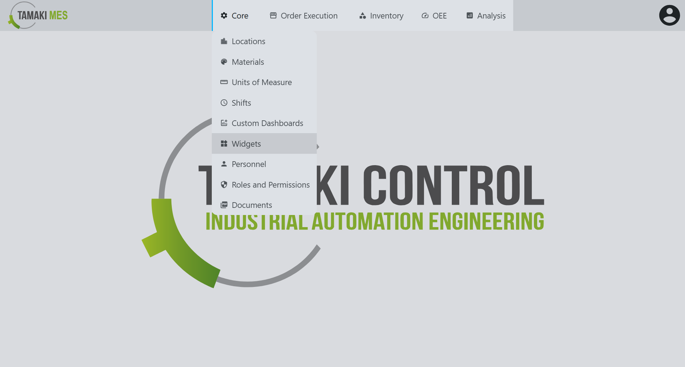
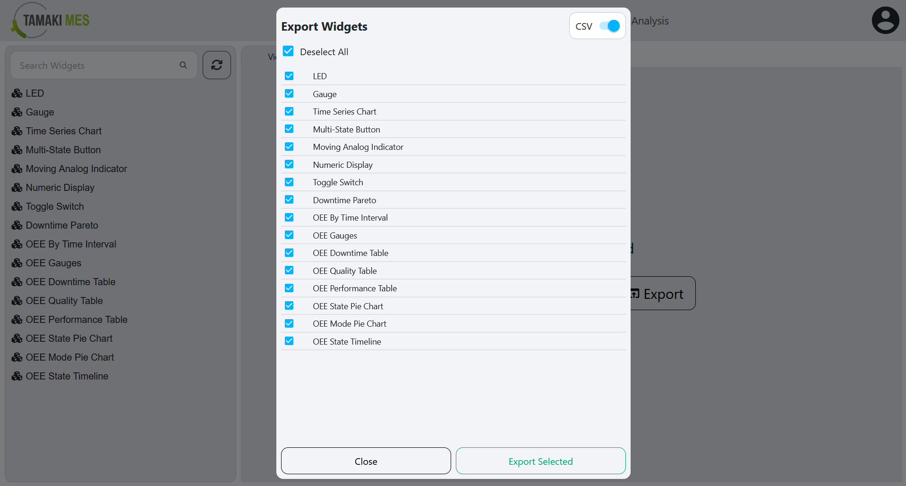

# Dashboard Widgets Import/Export

**Navigation:**

### Importing Dashboard Widgets

**How to use:**

- To import widgets, press the import button and add a CSV or JSON file to the file upload field.
Then press the confirm button.

- It is recommended to export at least one pre-existing widget to CSV to ensure the correct format of the CSV file.

### Exporting Dashboard Widgets

**How to use:**

- To export widgets, right click the widgets tree and click the export button. Select the widgets you'd wish to export then press the export selected button.