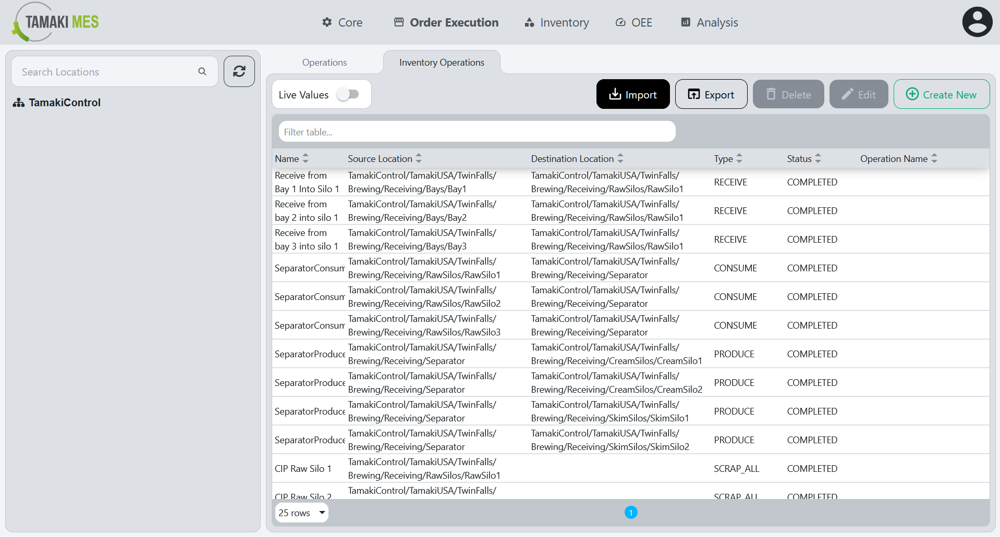

# Inventory Operations Import/Export

**Navigation:**

### Importing Inventory Operations

**How to use:**

- To import inventory operations, press the import button and add a CSV or JSON file to the file upload field. Then press the confirm button.

- It is recommended to export at least one pre-existing inventory  operation to CSV to ensure the correct format of the CSV file.

**Import Behavior:**

- When importing, the system checks whether an inventory operation already exists given the inventory operation name, source and destination location path and the operation type. If a match is found, the existing inventory operation is modified, otherwise a new inventory operation is created.

### Exporting Inventory Operations

**How to use:**

- To export inventory operations, press the export button and select the locations associated with the inventory operations you'd wish to export. Then press the export selected button.