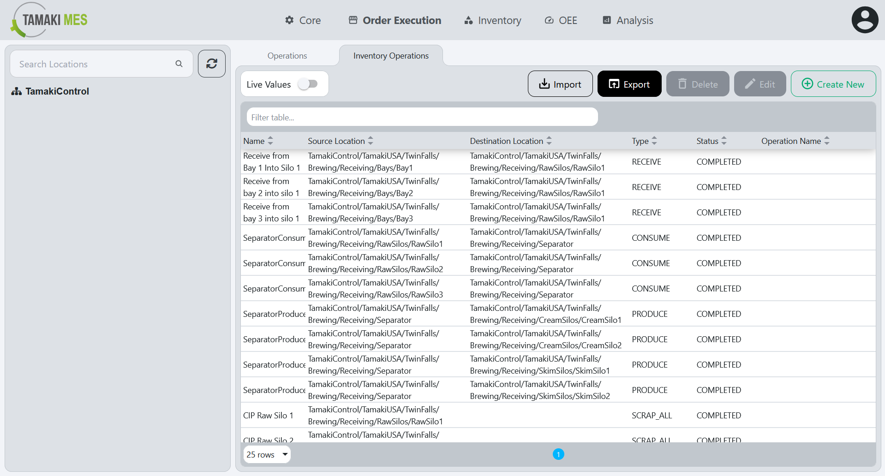

# Inventory Operations Import/Export

**Navigation:**

### Importing Inventory Operations

**How to use:**

- To import inventory operations, press the import button and add a CSV or JSON file to the file upload field.
Then press the confirm button.

- It is recommended to export at least one pre-existing inventory operation to CSV to ensure the correct format of the CSV file.

### Exporting Inventory Operations

**How to use:**

- To export inventory operations, right click the locations tree and click the export button. Select the inventory operations you'd wish to export then press the export selected button.