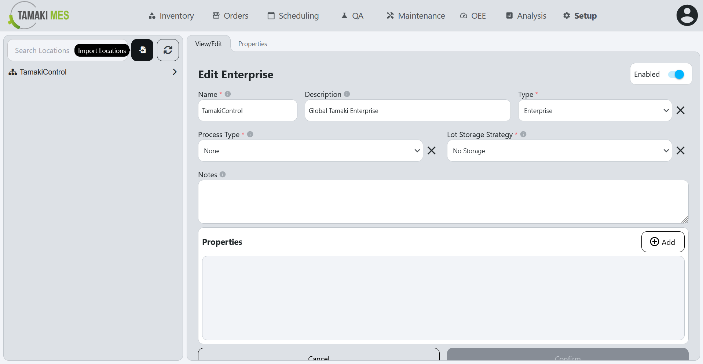
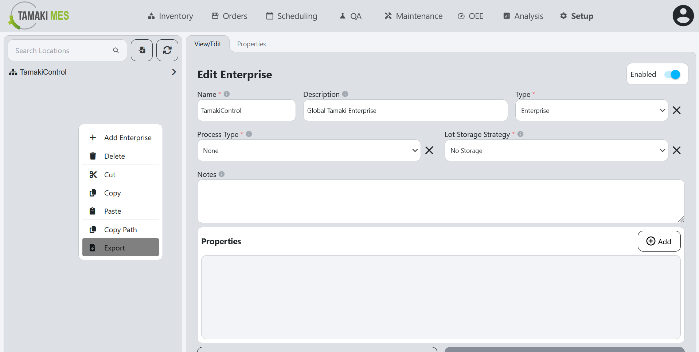

# Locations Import/Export

**Navigation:**

### Importing Locations

**How to use:**

- To import locations, press the import button and add a CSV or JSON file to the file upload field.
Then press the confirm button.

- It is recommended to export at least one pre-existing location to CSV to ensure the correct format of the CSV file.

### Exporting Locations

**How to use:**

- To export locations, right click the locations tree and click the export button. Select the locations you'd wish to export then press the export selected button.