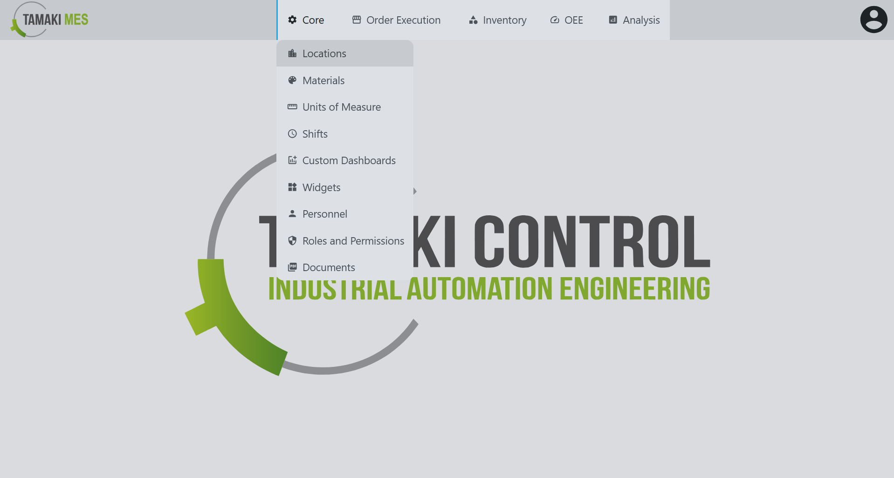

# Locations Import/Export

**Navigation:**

### Importing Locations

**How to use:**

- To import locations, press the import button and add a CSV or JSON file to the file upload field. Then press the confirm button.

- It is recommended to export at least one pre-existing location to CSV to ensure the correct format of the CSV file.

**Import Behavior:**

- When importing, the system checks whether a location already exists by path. If a match is found, the existing location is modified, otherwise a new location is created.

### Exporting Locations

**How to use:**

- To export locations, press the export button and select the locations you'd wish to export. Then press the export selected button.