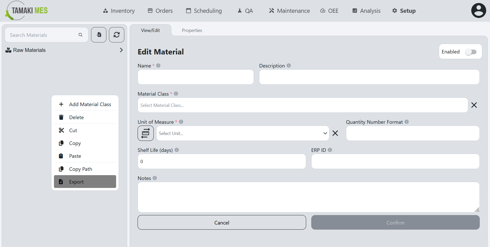

# Materials Import/Export

**Navigation:**

### Importing Materials

**How to use:**

- To import materials, press the import button and add a CSV or JSON file to the file upload field.
Then press the confirm button.

- It is recommended to export at least one pre-existing material to CSV to ensure the correct format of the CSV file.

### Exporting Materials

**How to use:**

- To export materials, right click the materials tree and click the export button. Select the materials and material classes you'd wish to export then press the export selected button.