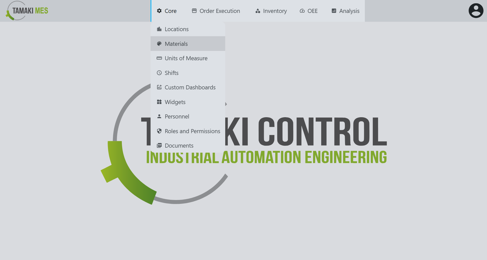
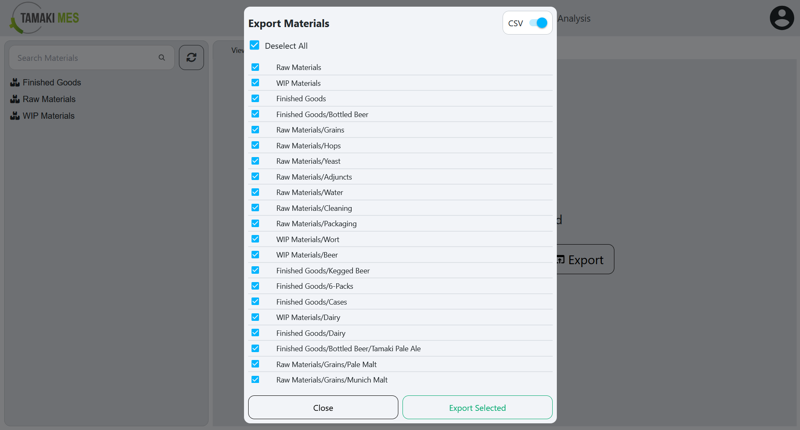

# Materials Import/Export

**Navigation:**

### Importing Materials

**How to use:**

- To import materials, press the import button and add a CSV or JSON file to the file upload field. Then press the confirm button.

- It is recommended to export at least one pre-existing material to CSV to ensure the correct format of the CSV file.

**Import Behavior:**

- **For Materials:** When importing, the system checks whether a material already exists by path. If no match is found, it then checks by ERP ID. If a match is found, the existing material is modified, otherwise a new material is created.

- **For Material Classes:** When importing, the system checks whether a material class already exists by path. If a match is found, the existing material class is modified, otherwise a new material class is created.

### Exporting Materials

**How to use:**

- To export materials, press the export button and select the materials and material classes you'd wish to export. Then press the export selected button.