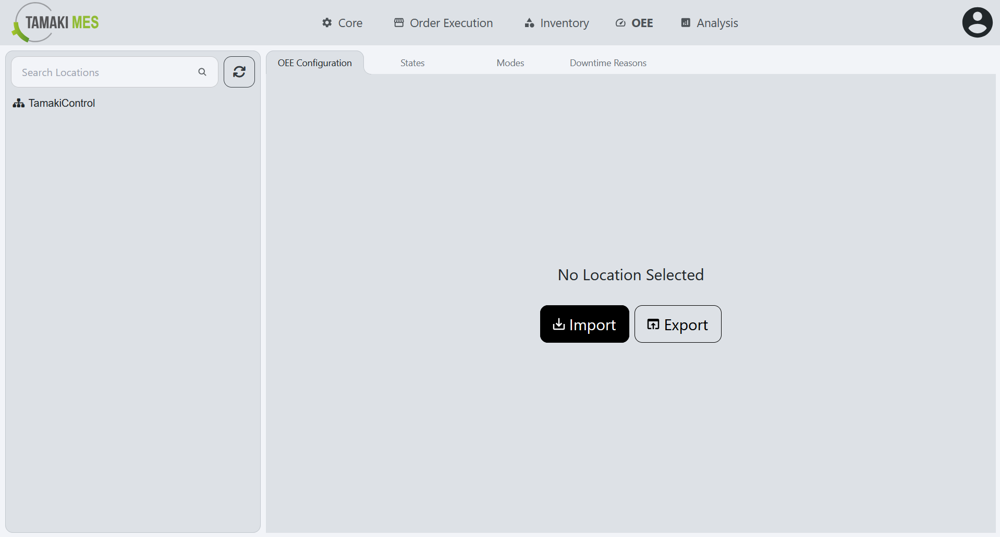
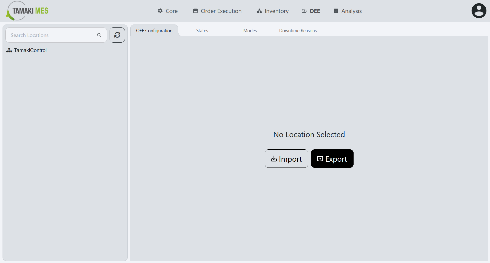
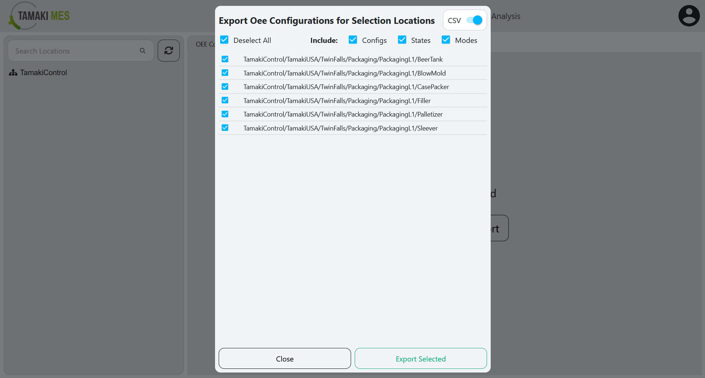
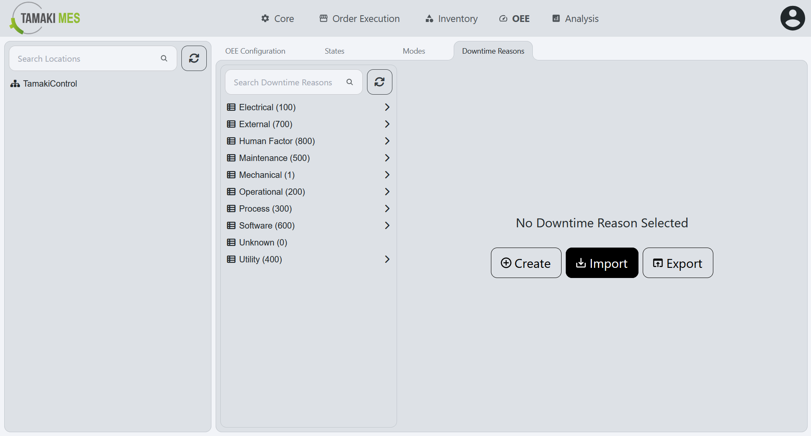

# OEE (Overall Equipment Effectiveness) Import/Export

It is recommended to import Modes and States before importing OEE configurations. Alternatively, you can import OEE configurations with `enabled = false` and enable them once the OEE Modes and OEE States have been successfully imported.

Importing enabled OEE configurations before the required OEE Modes and OEE States exist can lead to issues with the data collection service. This may result in inconsistent or unexpected behavior, and in some cases, a service restart may be required before data collection will function properly even after the OEE Modes and OEE States have been imported.

## OEE States

**Navigation:**

### Importing OEE States

**How to use:**

- To import OEE states, press the import button and add a CSV or JSON file to the file upload field.
Then press the confirm button.

- It is recommended to export at least one pre-existing OEE state to CSV to ensure the correct format of the CSV file.

**Import Behavior:**

- When importing, the system checks whether an OEE state already exists by location and state code. If a match is found, the existing OEE state is modified, otherwise a new OEE state is created.

### Exporting OEE States

**How to use:**

- To export OEE states, press the export button and select if you'd like to include the configuration, modes and states. Select the locations associated with the OEE states you'd wish to export. Then press the export selected button. 

## OEE Modes

**Navigation:**

### Importing OEE Modes

**How to use:**

- To import OEE modes, press the import button and add a CSV or JSON file to the file upload field.
Then press the confirm button.

- It is recommended to export at least one pre-existing OEE mode to CSV to ensure the correct format of the CSV file.

**Import Behavior:**

- When importing, the system checks whether an OEE mode already exists by location and mode code. If a match is found, the existing OEE mode is modified, otherwise a new OEE mode is created.

### Exporting OEE Modes

**How to use:**

- To export OEE modes, press the export button and select if you'd like to include the configuration, modes and states. Select the locations associated with the OEE modes you'd wish to export. Then press the export selected button. 

## OEE Configuration

**Navigation:**

### Importing OEE Configuration

**How to use:**

- To import OEE configurations, press the import button and add a CSV or JSON file to the file upload field. Then press the confirm button.

- It is recommended to export at least one pre-existing OEE configuration to CSV to ensure the correct format of the CSV file.

**Import Behavior:**

- When importing, the system checks whether an OEE configuration already exists by location. If a match is found, the existing OEE configuration is modified, otherwise a new OEE configuration is created.

### Exporting OEE Configuration

**How to use:**

- To export OEE configurations, press the export button and select if you'd like to include the configuration, modes and states. Select the locations associated with the OEE configuration you'd wish to export. Then press the export selected button. 

## OEE Downtime Reasons

**Navigation:**

### Importing OEE Downtime Reasons

**How to use:**

- To import OEE downtime reasons, press the import button and add a CSV or JSON file to the file upload field. Then press the confirm button.

- It is recommended to export at least one pre-existing OEE downtime reason to CSV to ensure the correct format of the CSV file.

**Import Behavior:**

- When importing, the system checks whether an OEE downtime reason already exists by downtime reason path. If a match is found, the existing OEE downtime reason is modified, otherwise a new OEE downtime reason is created.

### Exporting OEE Downtime Reasons

**How to use:**

- To export OEE downtime reasons, press the export button and select the OEE downtime reasons you'd wish to export. Then press the export selected button.