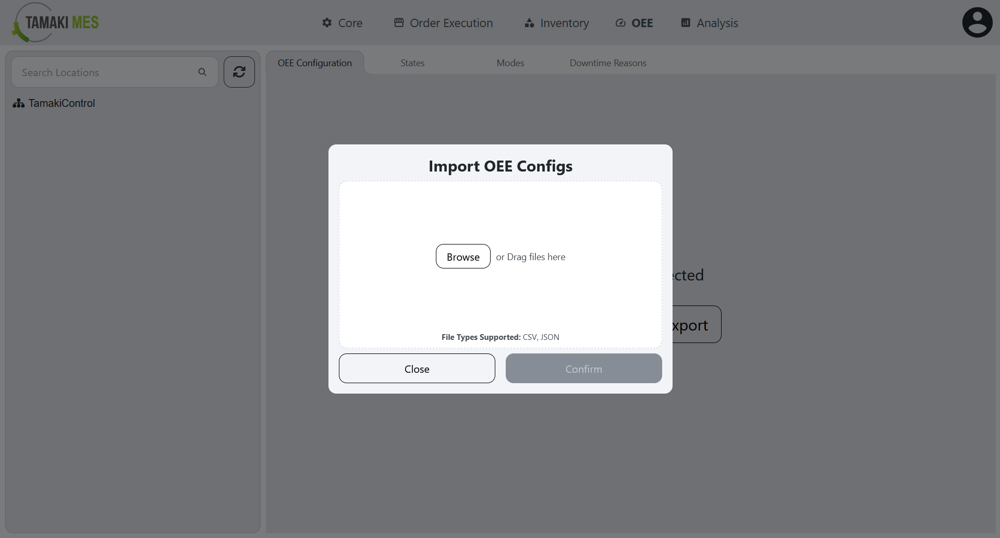
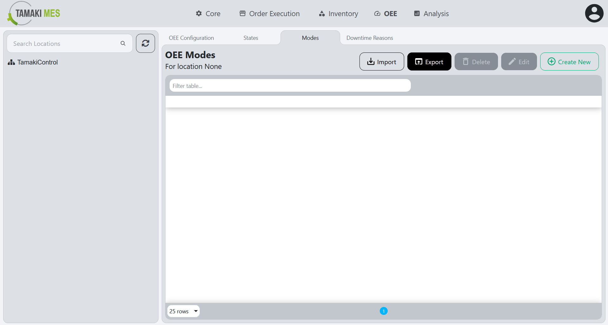
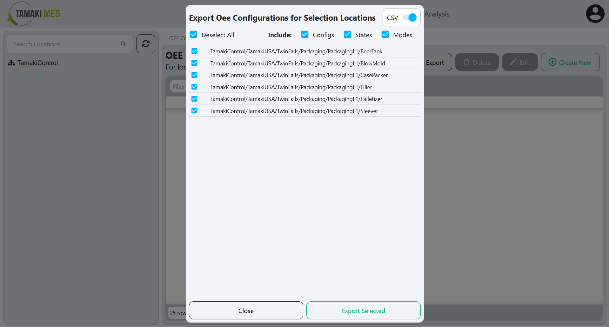
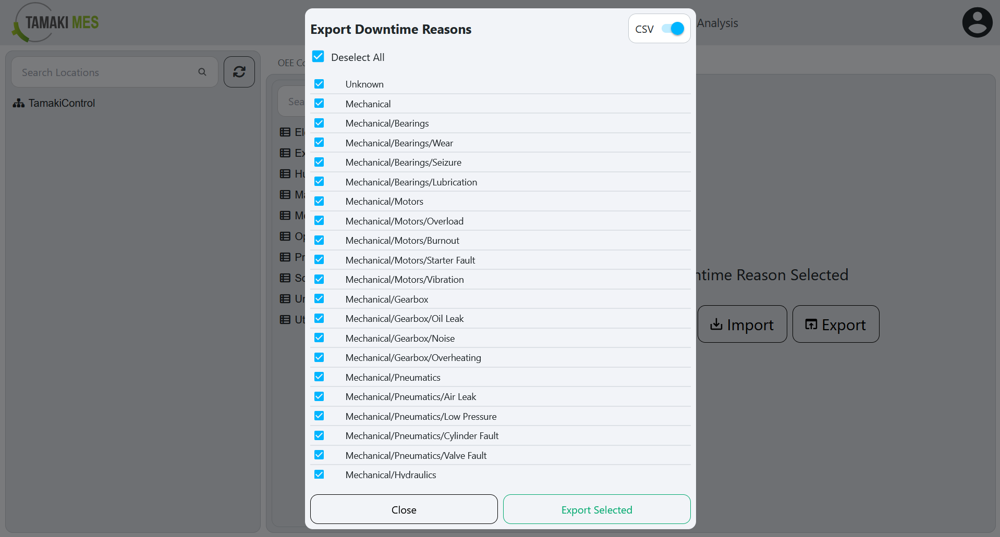

# OEE (Overall Equipment Effectiveness) Import/Export

## OEE Configuration

**Navigation:**

### Importing OEE Configuration

**How to use:**

- To import OEE configuration, press the import button and add a CSV or JSON file to the file upload field.
Then press the confirm button.

- It is recommended to export at least one pre-existing OEE configuration to CSV to ensure the correct format of the CSV file.

### Exporting OEE Configuration

**How to use:**

- To export OEE configuration, right click the locations tree and click the export button. Select the OEE configuration you'd wish to export and if you'd like to include the configuration, modes and states then press the export selected button.

## OEE States

**Navigation:**

### Importing OEE States

**How to use:**

- To import OEE states, press the import button and add a CSV or JSON file to the file upload field.
Then press the confirm button.

- It is recommended to export at least one pre-existing OEE state to CSV to ensure the correct format of the CSV file.

### Exporting OEE States

**How to use:**

- To export OEE states, right click the locations tree and click the export button. Select the OEE states you'd wish to export and if you'd like to include the configurations, modes and states then press the export selected button.

## OEE Modes

**Navigation:**

### Importing OEE Modes

**How to use:**

- To import OEE modes, press the import button and add a CSV or JSON file to the file upload field.
Then press the confirm button.

- It is recommended to export at least one pre-existing OEE mode to CSV to ensure the correct format of the CSV file.

### Exporting OEE Modes

**How to use:**

- To export OEE modes, right click the locations tree and click the export button. Select the OEE modes you'd wish to export and if you'd like to include the configurations, modes and states then press the export selected button.

## OEE Downtime Reasons

**Navigation:**

### Importing OEE Downtime Reasons

**How to use:**

- To import OEE downtime reasons, press the import button and add a CSV or JSON file to the file upload field.
Then press the confirm button.

- It is recommended to export at least one pre-existing OEE downtime reason to CSV to ensure the correct format of the CSV file.

### Exporting OEE Downtime Reasons

**How to use:**

- To export OEE downtime reasons, right click the locations tree and click the export button. Select the OEE downtime reasons you'd wish to export then press the export selected button.