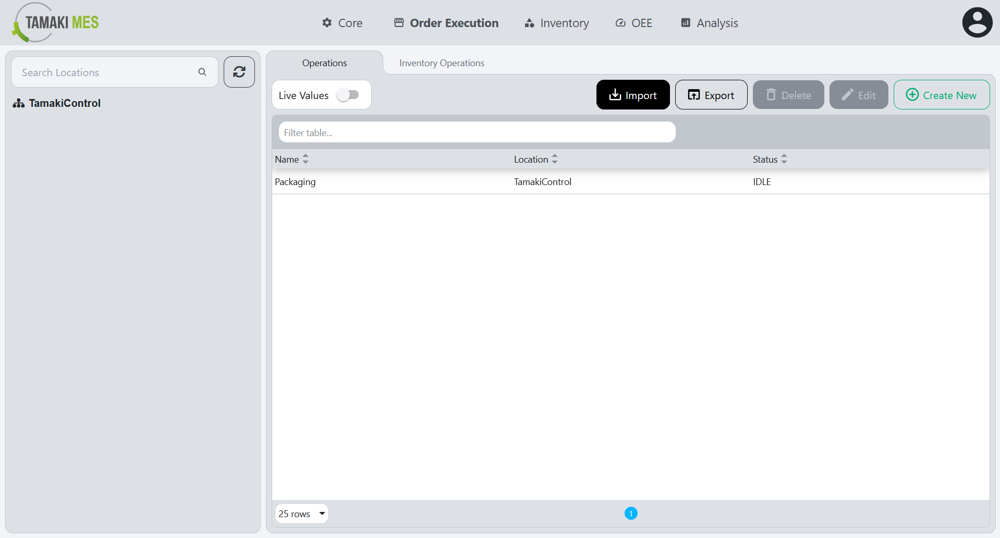

# Operations Import/Export

**Navigation:**

### Importing Operations

**How to use:**

- To import operations, press the import button and add a CSV or JSON file to the file upload field. Then press the confirm button.

- It is recommended to export at least one pre-existing operation to CSV to ensure the correct format of the CSV file.

**Import Behavior:**

- When importing, the system checks whether an operation already exists given the location path and operation name. If a match is found, the existing operation is modified, otherwise a new operation is created.

### Exporting Operations

**How to use:**

- To export operations, press the export button and select the locations associated with the operations you'd wish to export. Then press the export selected button.