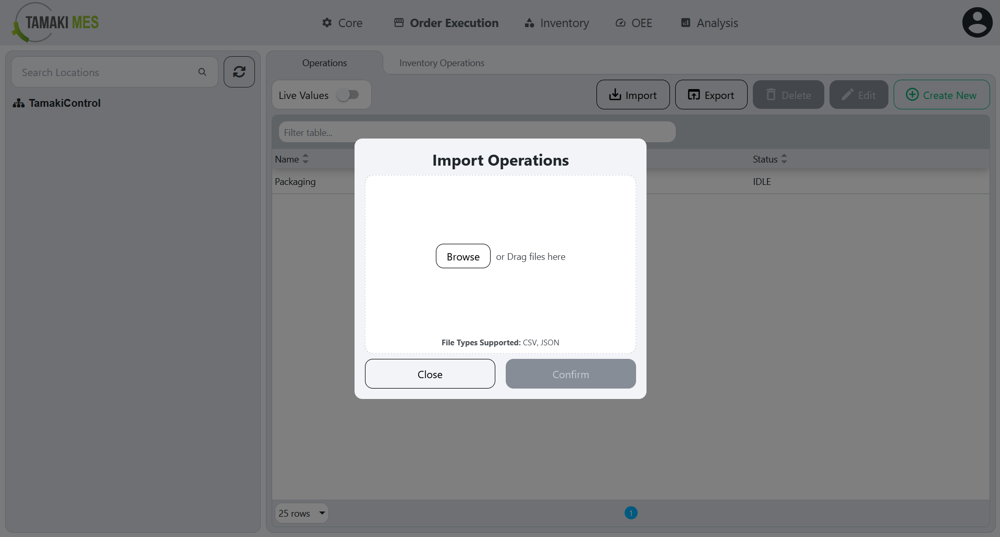
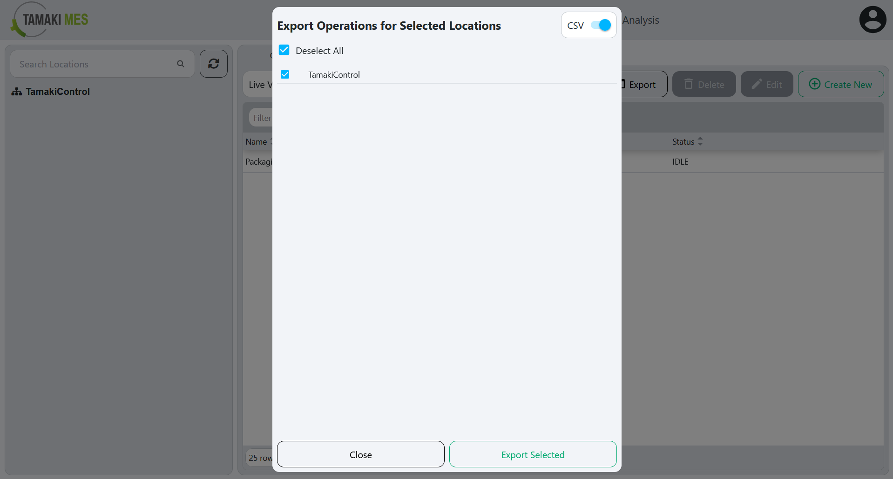

# Operations Import/Export

**Navigation:**

### Importing Operations

**How to use:**

- To import operations, press the either one of the import buttons and add a CSV or JSON file to the file upload field. Then press the confirm button.

- It is recommended to export at least one pre-existing operation to CSV to ensure the correct format of the CSV file.

### Exporting Operations

**How to use:**

- To export operations, right click the locations tree and click the export button. Select the operations you'd wish to export then press the export selected button.