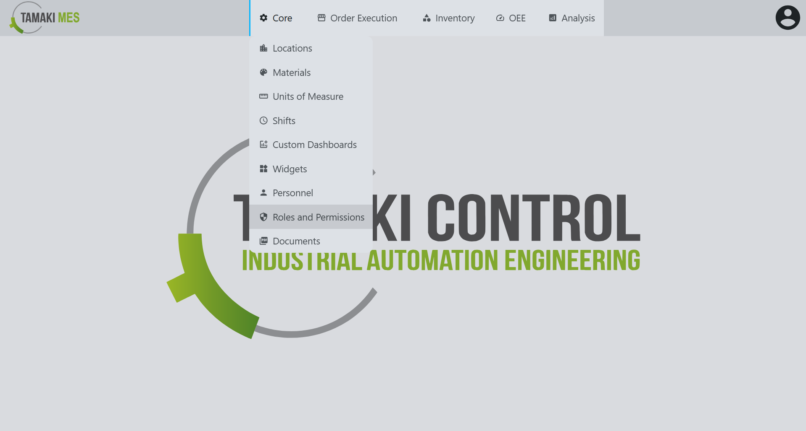

# Roles Import/Export

**Navigation:**

### Importing Roles

**How to use:**

- To import roles, press the import button and add a CSV or JSON file to the file upload field. Then press the confirm button.

- It is recommended to export at least one pre-existing role to CSV to ensure the correct format of the CSV file.

**Import Behavior:**

- When importing, the system checks whether a role already exists given the security level and permissions. If a match is found, the existing role is modified, otherwise a new role is created.

### Exporting Roles

**How to use:**

- To export roles, press the export button and select the roles you'd wish to export. Then press the export selected button.