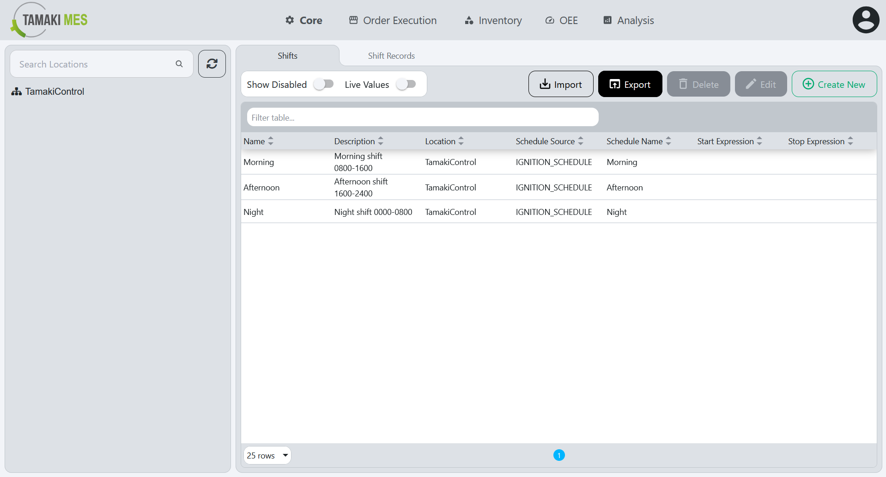

# Shifts Import/Export

**Navigation:**

### Importing Shifts

**How to use:**

- To import shifts, press the import button and add a CSV or JSON file to the file upload field. Then press the confirm button.

- It is recommended to export at least one pre-existing shift to CSV to ensure the correct format of the CSV file.

**Import Behavior:**

- When importing, the system checks whether a shift already exists given the location path and shift name. If a match is found, the existing shift is modified, otherwise a new shift is created.

### Exporting Shifts

**How to use:**

- To export shifts, press the export button and select the locations associated with the shifts you'd wish to export. Then press the export selected button.