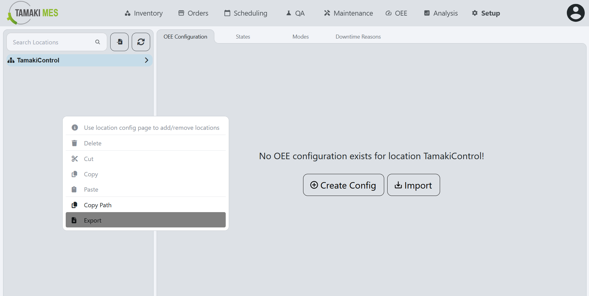

# Units of Measure Import/Export

## Units of Measure Conversions

**Navigation:**

### Importing UoM Conversions

**How to use:**

- To import UoM conversions, press the import button and add a CSV or JSON file to the file upload field.
Then press the confirm button.

- It is recommended to export at least one pre-existing UoM conversions to CSV to ensure the correct format of the CSV file.

### Exporting UoM Conversions

**How to use:**

- To export UoM conversions, right click the units of measure tree and click the export button. Select the UoM conversions you'd wish to export then press the export selected button.

## Units of Measure Configuration

**Navigation:**

### Importing UoM Configuration

**How to use:**

- To import OEE configuration, press the import button and add a CSV or JSON file to the file upload field.
Then press the confirm button.

- It is recommended to export at least one pre-existing OEE configuration to CSV to ensure the correct format of the CSV file.

### Exporting UoM Configuration

**How to use:**

- To export OEE configuration, right click the units of measure tree and click the export button. Select the OEE configuration you'd wish to export then press the export selected button.