# Units of Measure Import/Export

## Units of Measure Configuration

**Navigation:**

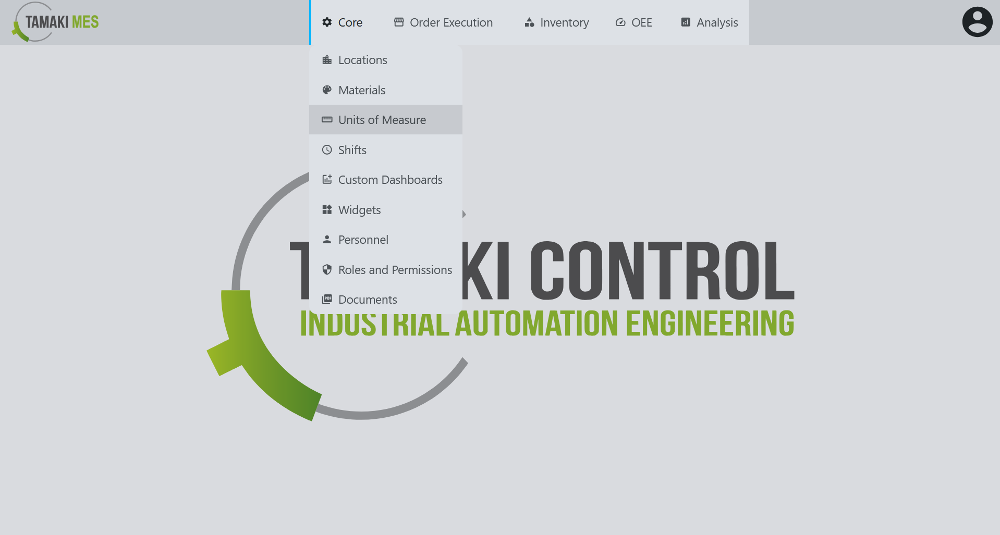

### Importing UoM Configuration

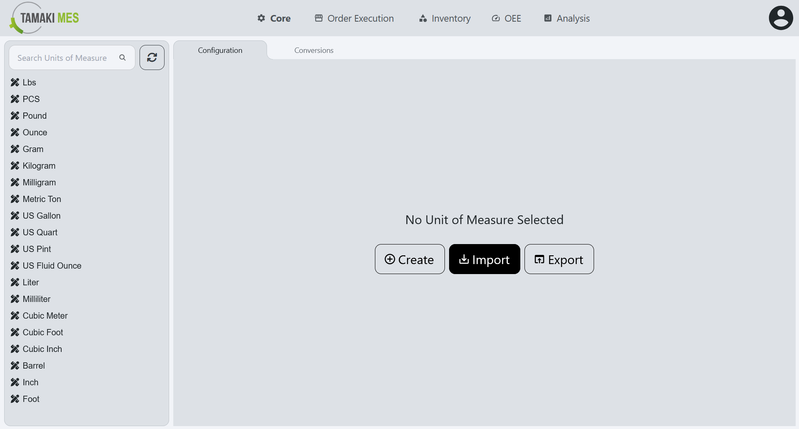

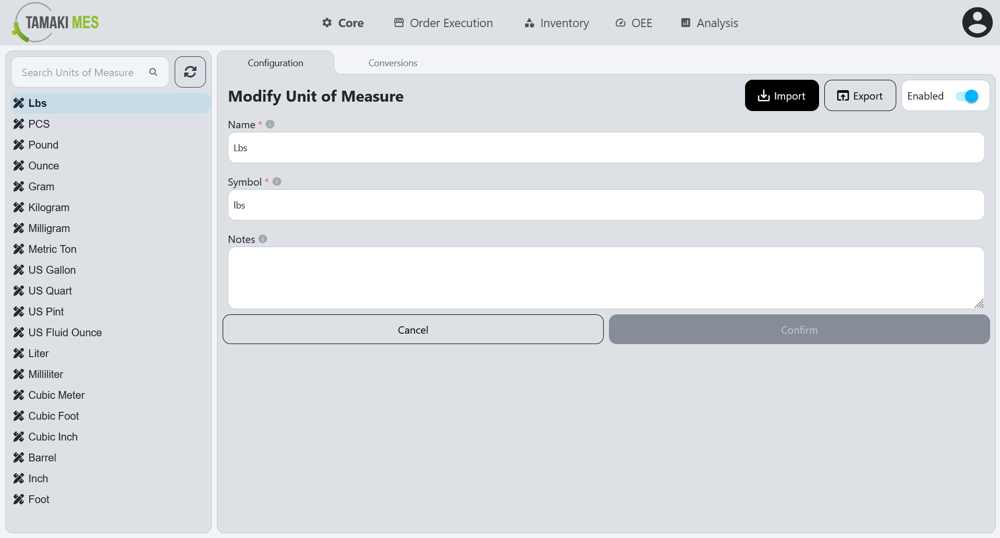

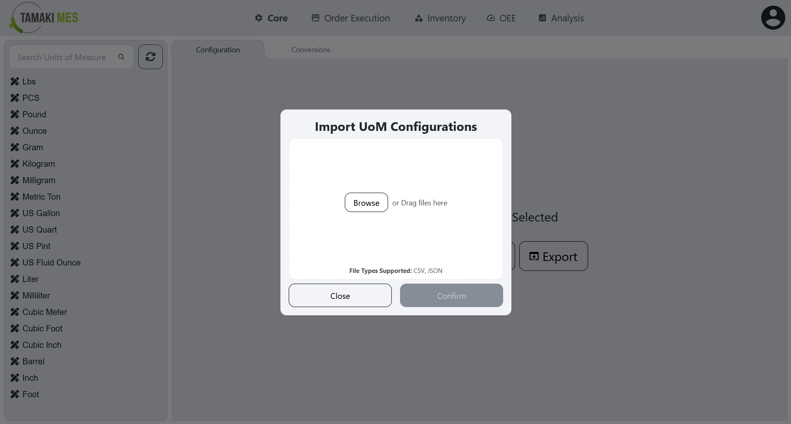

**How to use:**

- To import UoM configurations, press the import button and add a CSV or JSON file to the file upload field. Then press the confirm button.

- It is recommended to export at least one pre-existing UoM configuration to CSV to ensure the correct format of the CSV file.

**Import Behavior:**

- When importing, the system checks whether a UoM configuration already exists by name. If a match is found, the existing UoM configuration is modified, otherwise a new UoM configuration is created.

### Exporting UoM Configuration

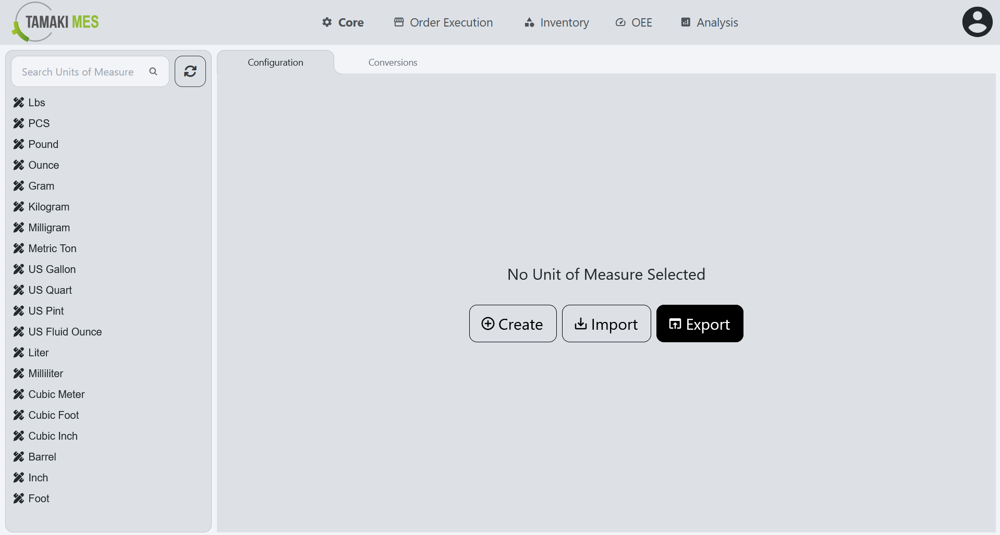

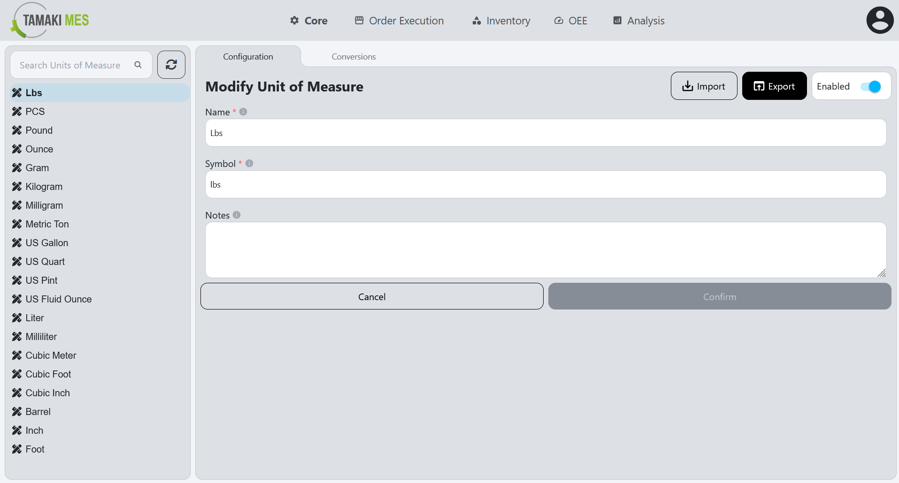

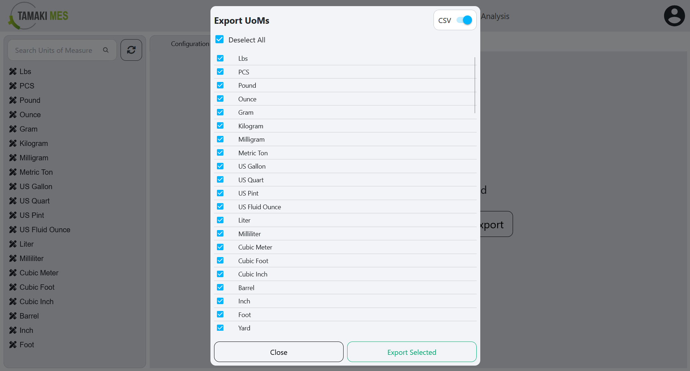

**How to use:**

- To export UoM configurations, press the export button and select the UoM configurations you'd wish to export. Then press the export selected button.

## Units of Measure Conversions

**Navigation:**

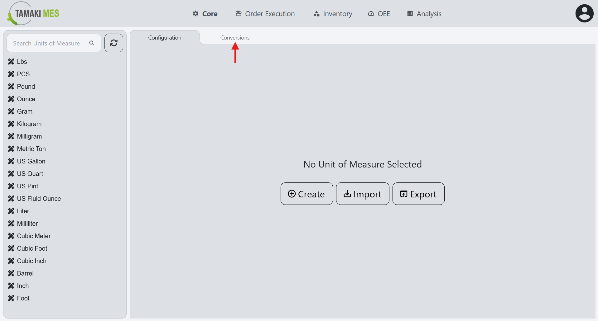

### Importing UoM Conversions

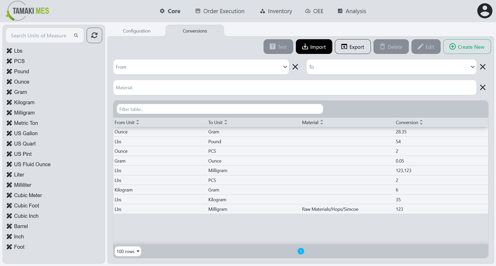

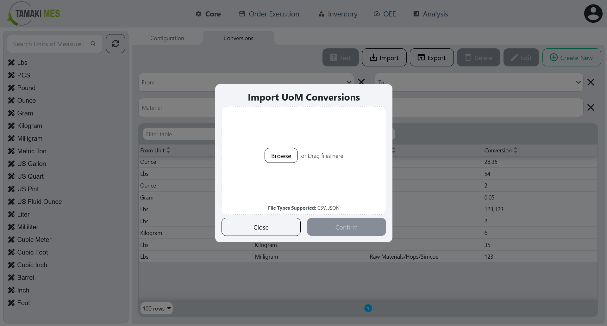

**How to use:**

- To import UoM conversions, press the import button and add a CSV or JSON file to the file upload field. Then press the confirm button.

- It is recommended to export at least one pre-existing UoM conversion to CSV to ensure the correct format of the CSV file.

**Import Behavior:**

- When importing, the system checks whether a UoM conversion already exists for the given material, “from” UoM, and “to” UoM. If a match is found, the existing UoM conversion is modified, otherwise a new UoM conversion is created.

### Exporting UoM Conversions

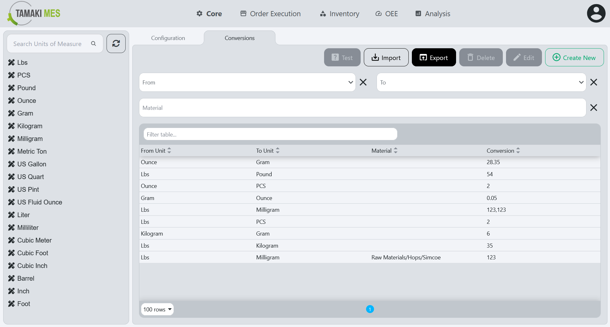

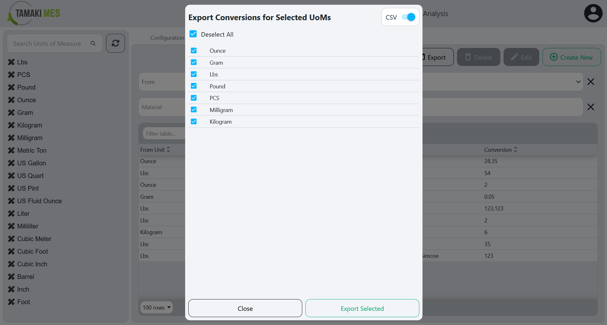

**How to use:**

- To export UoM conversions, press the export button and select the UoM conversions you'd wish to export. Then press the export selected button.