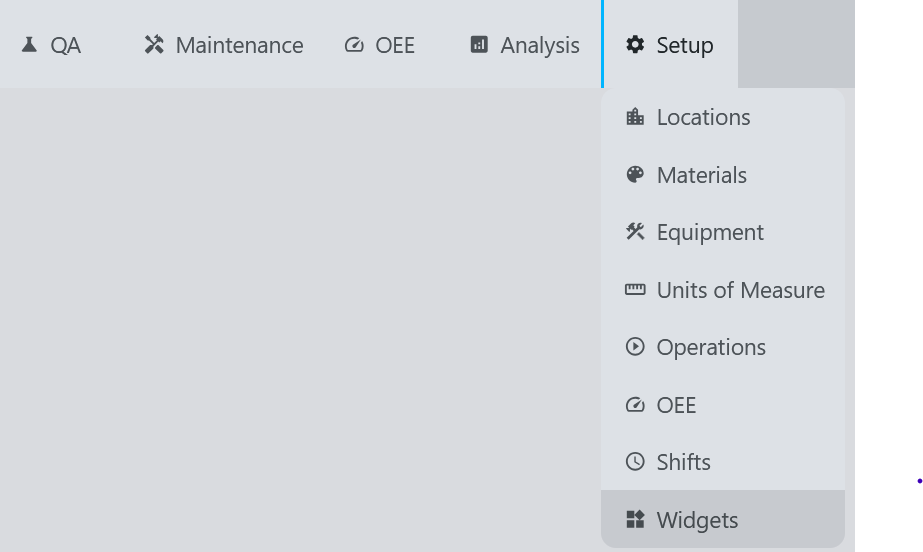
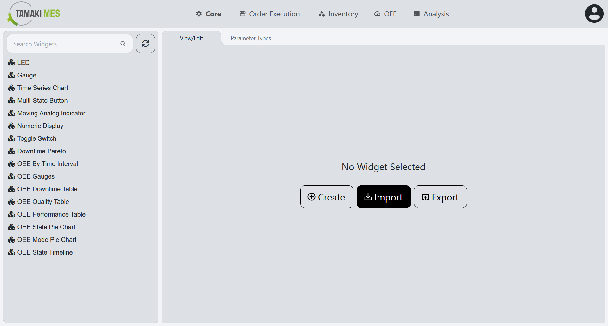
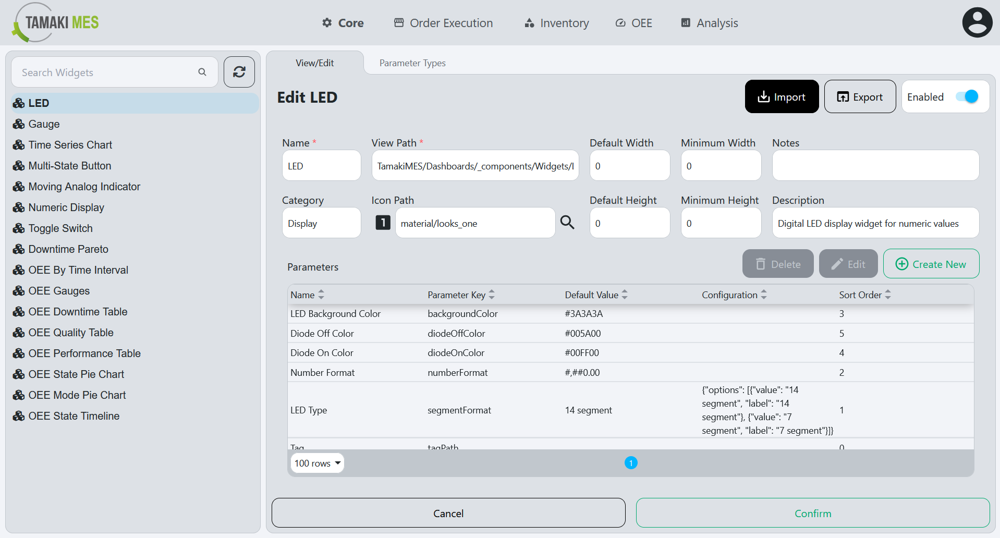
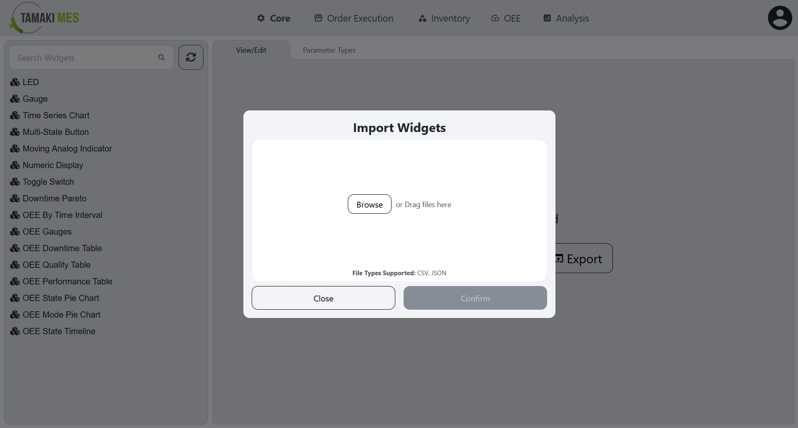
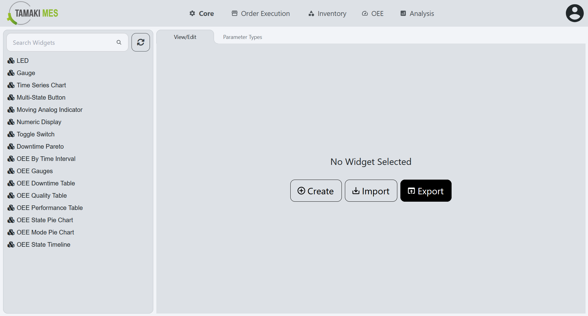
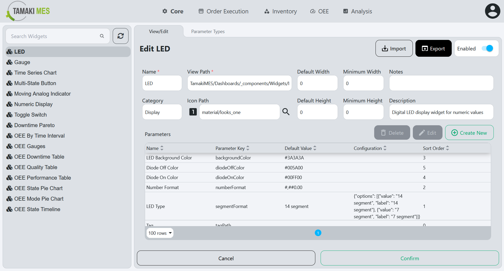
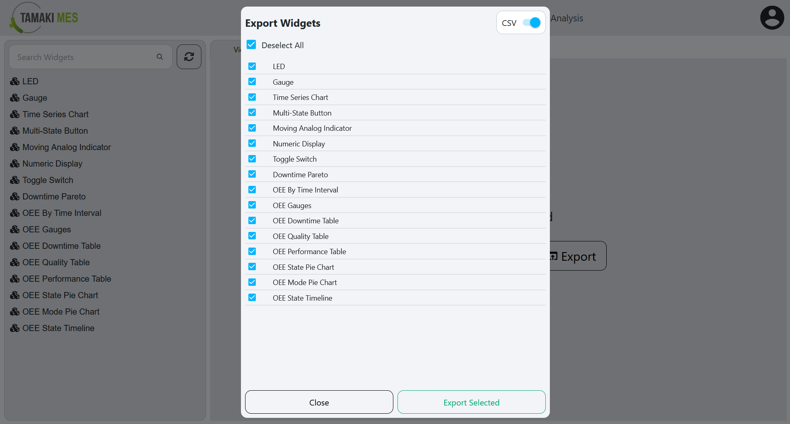

# Widgets Import/Export

**Navigation:**

### Importing Widgets

**How to use:**

- To import widgets, press the import button and add a CSV or JSON file to the file upload field. Then press the confirm button.

- It is recommended to export at least one pre-existing widget to CSV to ensure the correct format of the CSV file.

**Import Behavior:**

- When importing, the system checks whether a widget already exists given the widget name. If no match is found, it then checks by ID. If a match is found, the existing widget is modified, otherwise a new widget is created.

### Exporting Widgets

**How to use:**

- To export widgets, press the export button and select the widgets you'd wish to export. Then press the export selected button.