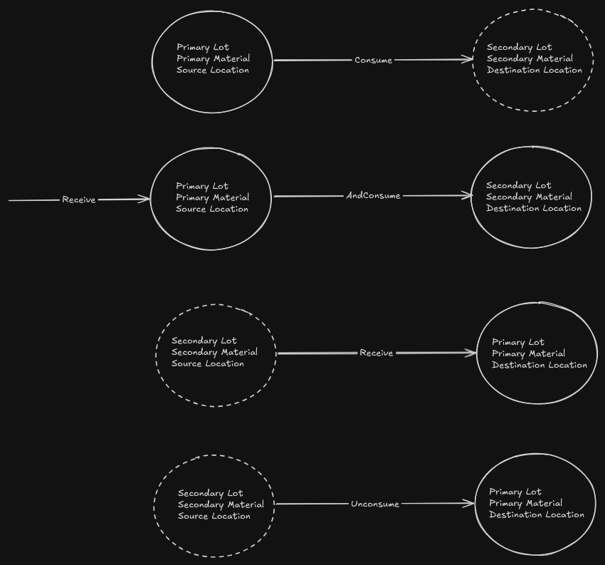
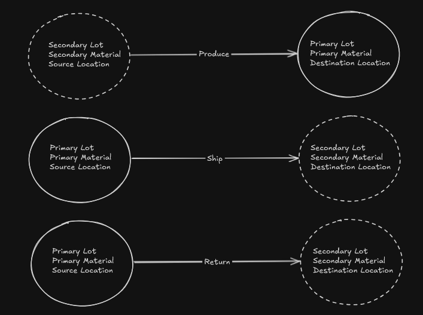
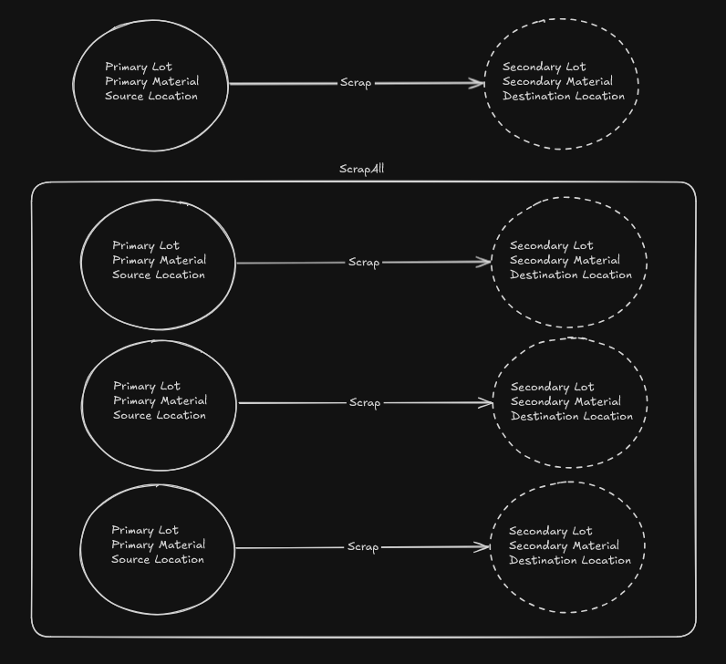

# Inventory Operation Types Diagram
This diagram illustrates the logical flow of each Inventory Operation Type between primary and secondary lots, materials, as well as source and destination locations.

- Solid circles and arrows represent required entities and flows for basic operation execution.
- Dashed circles represent optional relationships. These are not needed if you only require basic inventory operation execution.
- However, if your system is configured for full Track & Trace functionality, the secondary lot/material/location relationships (shown as dashed) become required for complete traceability.

