# Downtime Entry

**Navigation:**

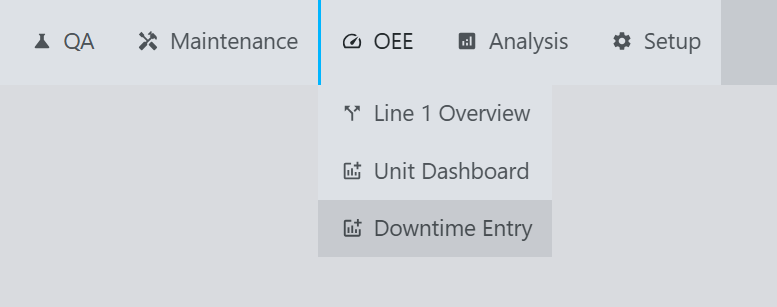

**Example:**
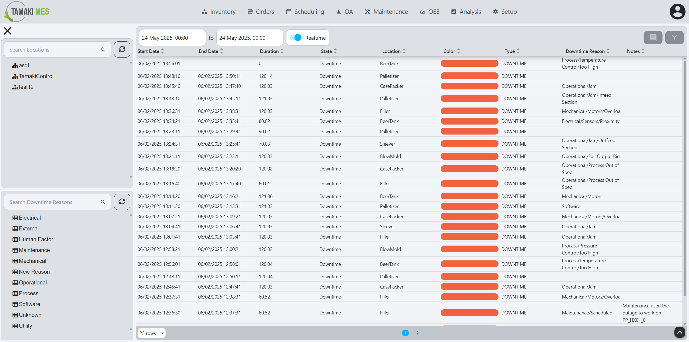

**Description:**
- The Downtime Entry screen allows users to acknowledge downtime events and enter details about the downtime, such as the reason for the downtime, the start and end times, and any additional notes. This information is crucial for analyzing downtime trends and improving [OEE](terms-and-definitions#oee-overall-equipment-effectiveness).

**Components:**
- [Location Tree](#location-tree)
- [Downtime Reason Tree](#downtime-reason-tree)
- [Downtime Event Table](#downtime-event-table)

## Location Tree
**Example:**
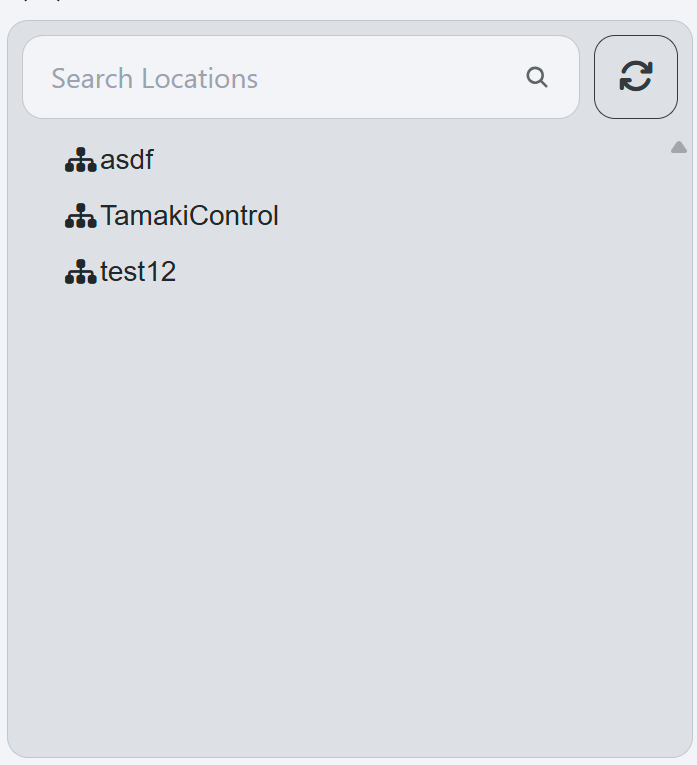

**Description:**
- TODO The Location Tree displays the hierarchy of locations within the production line. Users can select a specific location to view and manage downtime events associated with that location. The tree structure allows for easy navigation through different levels of the production line.

## Downtime Reason Tree
**Example:**
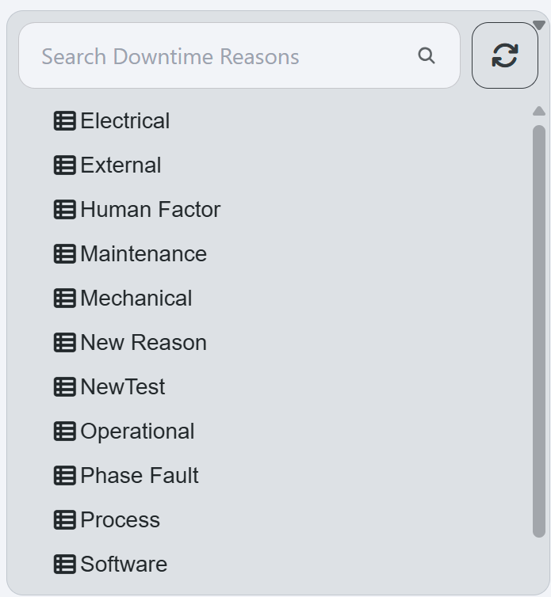

**Description:**
- The Downtime Reason Tree displays the available downtime reasons that can be selected when entering a downtime event. Users can select a reason to view and manage downtime events associated with that reason. The tree structure allows for easy navigation through different categories of downtime reasons.

## Downtime Event Table
**Example:**
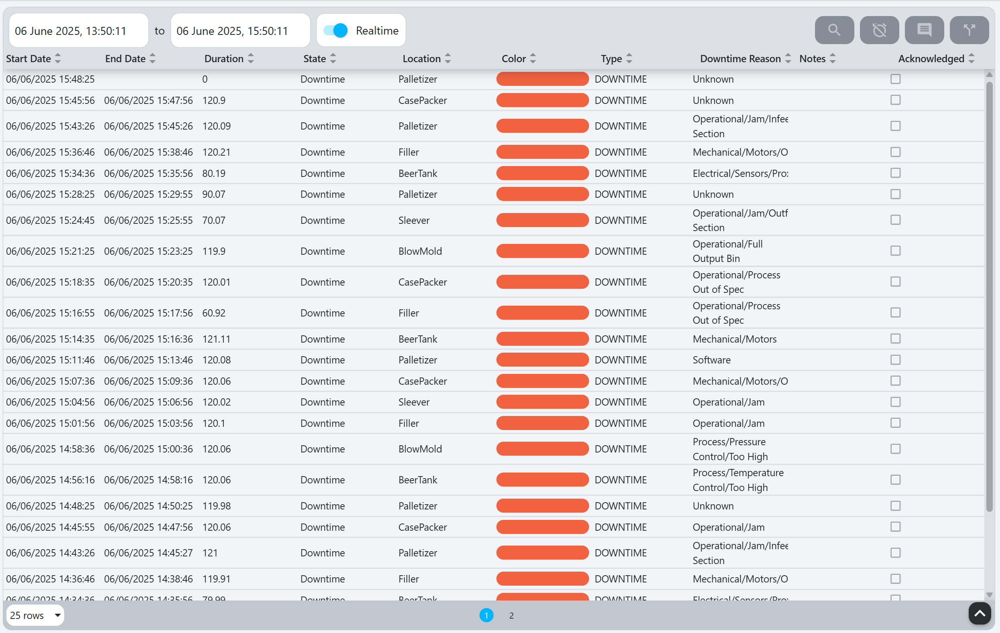

**Description:**
- The Downtime Event Table displays a list of downtime events that have been entered for the selected location and downtime reason. Each row in the table represents a specific downtime event.

## Components

### Table Columns
| **Column**          | **Description**                                                                                                                                 |
|---------------------|-------------------------------------------------------------------------------------------------------------------------------------------------|
| **Start Date**      | Start date of the downtime event.                                                                                                               |
| **End Date**        | End date of the downtime event.                                                                                                                 |
| **Duration**        | Duration of the downtime event.                                                                                                                 |
| **State**           | State of the Location during the downtime event.                                                                                                |
| **Location**        | Location that the downtime event is occuring for.                                                                                               |
| **Colour**          | TODO Colour of the state of the downtime event.                                                                                                 |
| **Type**            | Type of the downtime event.                                                                                                                     |
| **Downtime Reason** | Downtime reason associated with the downtime event. see [OEE Downtime Reason Model](../../appendix/data-model/oee-model/oee-downtime-reason.md) |
| **Notes**           | Additional notes or comments about the downtime event.                                                                                          |
| **Acknowledged**    | Boolean of whether the downtime event has been acknowledged.                                                                                    |

### Table Buttons

#### View Event Details
- The View Event Details button  opens the following popup:
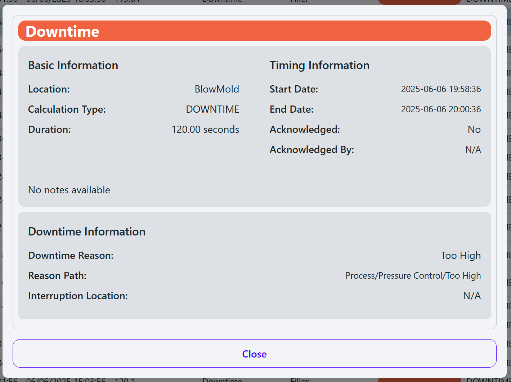

**Description:** Displays detailed information about the selected downtime event. This includes the start and end times, duration, state, location, downtime reason, notes, and whether the event has been acknowledged.

#### Acknowledge Event
- The Acknowledge Event button 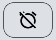 opens the following popup:
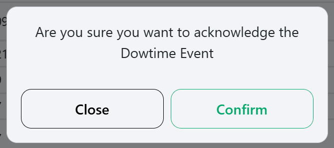

**Description:** Allows users to acknowledge the selected downtime event. TODO Acknowledging an event marks it as reviewed and prevents further edits. Users can also add notes related to the acknowledgment.

#### Set Reason Code
- The Set Reason Code button  opens the downtime reason selection popup:
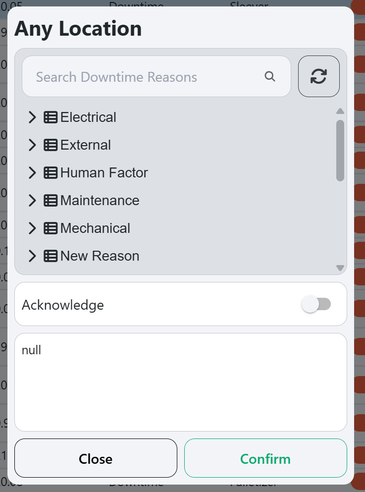

**Description:** TODO Allows users to select a downtime reason for the selected event. The popup displays a tree structure of predefined downtime reasons, enabling users to choose the most appropriate reason for the downtime event. Users can also add notes related to the downtime reason.

#### Split Downtime Event
- The Split Downtime Event button 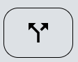 opens the Split Downtime Event popup:
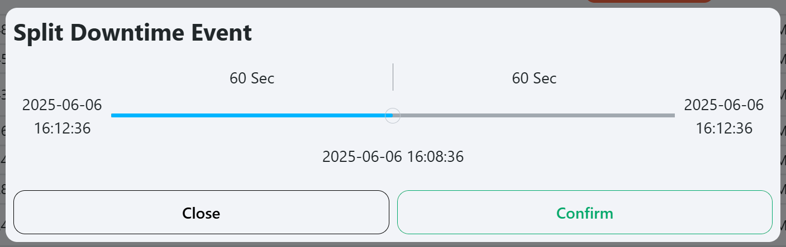

**Description:** Allows users to split the selected downtime event into two separate events. This is useful when a downtime event spans multiple reasons or states. The popup allows users to drag the split line to adjust the start and end times of the new event.
