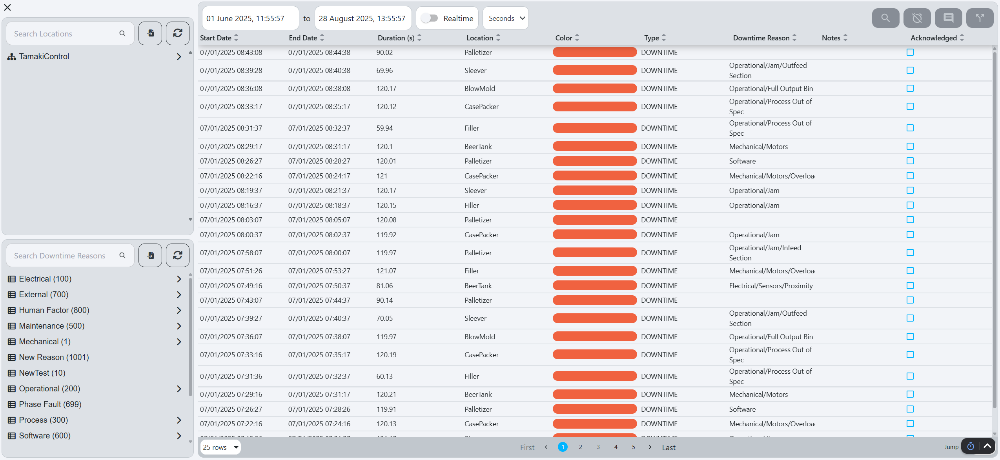
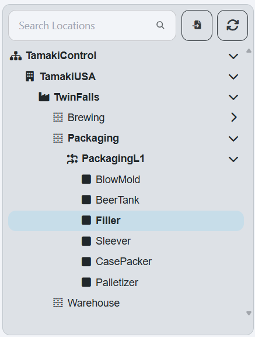

# Downtime Entry

**Navigation:**

**Example:**

**Description:**
- The Downtime Entry screen allows users to acknowledge downtime events and enter details about the downtime, such as the reason for the downtime, the start and end times, and any additional notes. This information is crucial for analyzing downtime trends and improving [OEE](terms-and-definitions#oee-overall-equipment-effectiveness).

**Components:**
- [Location Tree](#location-tree)
- [Downtime Reason Tree](#downtime-reason-tree)
- [Downtime Event Table](#downtime-event-table)

## Location Tree
**Example:**

**Description:**
- The Location Tree displays the hierarchy of locations within the production line. Users can select a specific location to view and manage downtime events associated with that location. The tree structure allows for easy navigation through different levels of the production line.

## Downtime Reason Tree
**Example:**

**Description:**
- The Downtime Reason Tree displays the available downtime reasons that can be selected when entering a downtime event. Users can select a reason to view and manage downtime events associated with that reason. The tree structure allows for easy navigation through different categories of downtime reasons.

## Downtime Event Table
**Example:**

**Description:**
- The Downtime Event Table displays a list of downtime events that have been entered for the selected location and downtime reason. Each row in the table represents a specific downtime event.

### Components

#### Table Columns
| **Column**          | **Description**                                                                                                                                 |
|---------------------|-------------------------------------------------------------------------------------------------------------------------------------------------|
| **Start Date**      | Start date of the downtime event.                                                                                                               |
| **End Date**        | End date of the downtime event.                                                                                                                 |
| **Duration**        | Duration of the downtime event.                                                                                                                 |
| **State**           | State of the Location during the downtime event.                                                                                                |
| **Location**        | Location that the downtime event is occuring for.                                                                                               |
| **Color**           | TODO Color of the state of the downtime event.                                                                                                  |
| **Type**            | Type of the downtime event.                                                                                                                     |
| **Downtime Reason** | Downtime reason associated with the downtime event. see [OEE Downtime Reason Model](../../appendix/data-model/oee-model/oee-downtime-reason.md) |
| **Notes**           | Additional notes or comments about the downtime event.                                                                                          |
| **Acknowledged**    | Boolean of whether the downtime event has been acknowledged.                                                                                    |

#### Table Buttons

##### View Event Details

- The `View Event Details` button, , opens the Downtime Event Details popup:

- **Sections:**
  - **Top Bar State:** displays the current [State](terms-and-definitions#state) of the downtime event and its corresponding color.
  - **Basic and Timing Information:** Displays the basic information about the downtime event, including the following:
      - Location
      - Calculation Type
      - Duration
      - Start Date
      - End Date
      - Acknowledged (Yes/No)
      - Acknowledged By
      - Notes
  - **Downtime Information:** Displays the information about the downtime, including the following:
      - Downtime Reason
      - Reason Path
      - Interruption Location

##### Acknowledge Event

- The `Acknowledge Downtime Event` button, , opens the Acknowledge Downtime Event popup:

- **Sections:**
  - **Confirm:** Click `Confirm` to acknowledge the selected downtime event, marking it as reviewed and preventing further edits.

##### Set Reason Code
 
- The `Set Downtime Reason` button, , opens the downtime reason selection popup:

- **Sections:**
  - **Downtime Reason Selection Tree:** Allows users to select a reason for the downtime event from a hierarchical list of predefined reasons.
  - **Acknowledge Button:** Clicking this button acknowledges the downtime event, marking it as reviewed and preventing further edits.
  - **Notes Field:** A text field for users to add additional notes or comments related to the downtime event.

##### Split Downtime Event
- The `Split Downtime Event` button, , opens the Split Downtime Event popup:

- **Sections:**
  - **Slider:** Select and drag the middle slider to choose the split point for the downtime event.
  - **Confirm:** Click `Confirm` to split the selected downtime event into two separate events at the chosen point.