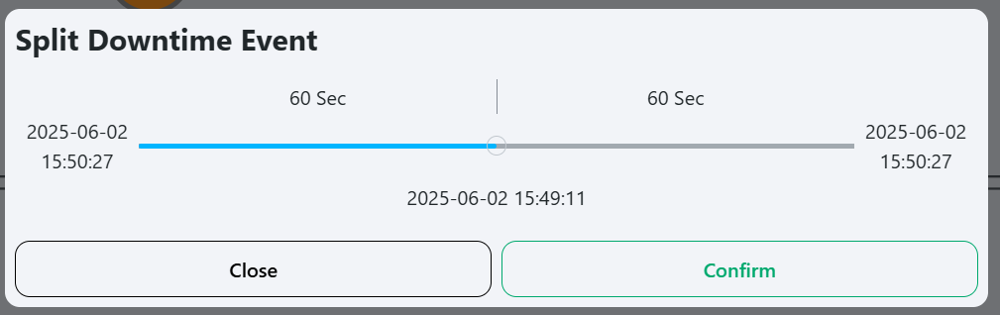

# Line Overview

**Navigation:**

**Example:**

**Description:**
- The Line Overview screen provides a comprehensive view of the production line's performance, including OEE metrics, downtime records, and a graphical representation of the line's status. It allows users to monitor the overall effectiveness of the equipment and identify areas for improvement.

**Components:**
- [Top Bar](#top-bar)
- [Line Graphic](#line-graphic)
- [Downtime Records](#downtime-records)

## Top Bar
**Example:**

**Description:**
- The top bar of the Line Overview screen displays key information about the selected line, including:
  - **Current Order Status**: 
  
  The percentage of the current order that has been completed, the state of the order, and what may be causing delays (i.e. what is starving it).

  - **Current OEE**:
  
  The overall equipment effectiveness of the line, calculated based on availability, performance, and quality metrics.

  - **OEE State Timeline**:
  
  A timeline that shows the historical OEE state of the line, allowing users to see trends and patterns over time. Hover over the coloured bars that make up the timeline to see the start time, end time, and duration of the event associated with the colour (see [States](setup#states) for what state each colour represents).
  
## Line Graphic
**Example:**

**Description:**
- The line graphic provides a visual representation of the production line, showing the current state of each piece of equipment. It includes:
  - **Equipment States**: Each piece of equipment is color-coded to indicate its current state (e.g., running, stopped, fault).
  - **OEE Metrics**: The OEE metrics for each piece of equipment are displayed, allowing users to quickly assess performance.
  - **Interactive Elements**: Users can click on individual pieces of equipment to view detailed information and historical data.

Selecting a node opens the following popup:

These table details include:

| **Field** | **Description**                    |
|-----------|------------------------------------|
| Step      | What step it is on                 |
| Status    | Current state of the selected node |
| Trans     | TODO                               |
| Message   | TODO                               |
| Hold      | TODO                               |

Clicking on `View Steps` opens the following popup:
TODO

Change the [Mode](setup#modes) of the note by clicking `On`, `Off`, `Resume`, Or `Hold`. TODO

## Downtime Records
**Example:**

**Description:**
- The downtime records section displays a list of downtime events for the selected line. It includes:
  - **Downtime Duration**: The total duration of each downtime event.
  - **Location**: The specific piece of equipment or area where the downtime occurred.
  - **Reason Codes**: The reason for each downtime event, allowing users to categorize and analyze downtime causes.
  - **Notes**: Additional notes or comments related to each downtime event, providing context and details for analysis.

Refer to [tables](TODO) for information on how tables work in Tamaki MES.

Selecting a row in the table allows the two buttons in the top left of the downtime records section to be selected.

The  button opens the downtime reason selection popup:

**Sections:**
- **Downtime Reason Selection Tree:** Allows users to select a reason for the downtime event from a hierarchical list of predefined reasons.
- **Acknowledge Button:** Clicking this button acknowledges the downtime event, marking it as reviewed and preventing further edits.
- **Notes Field:** A text field for users to add additional notes or comments related to the downtime event.

The  button opens the Split Downtime Event popup:

**Sections:**
- Select and drag the middle slider to choose the split point for the downtime event.
- Click `Confirm` to split the selected downtime event into two separate events at the chosen point.
