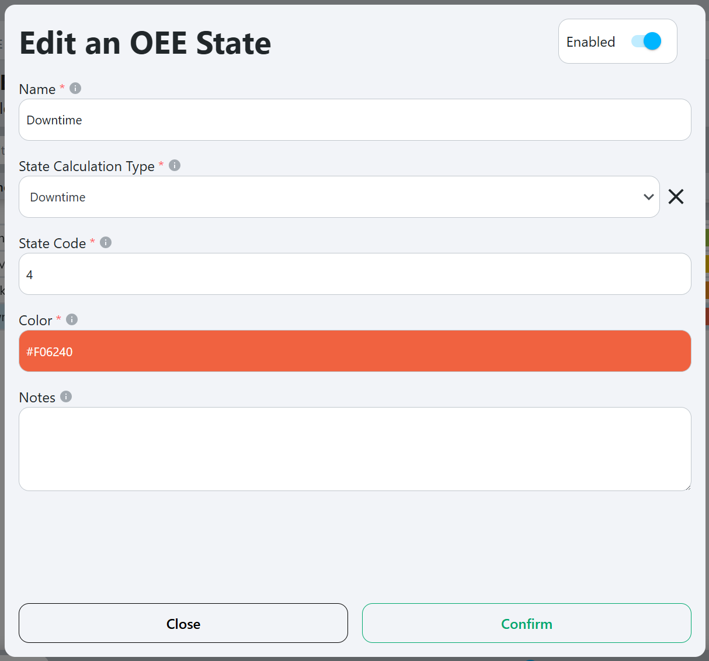
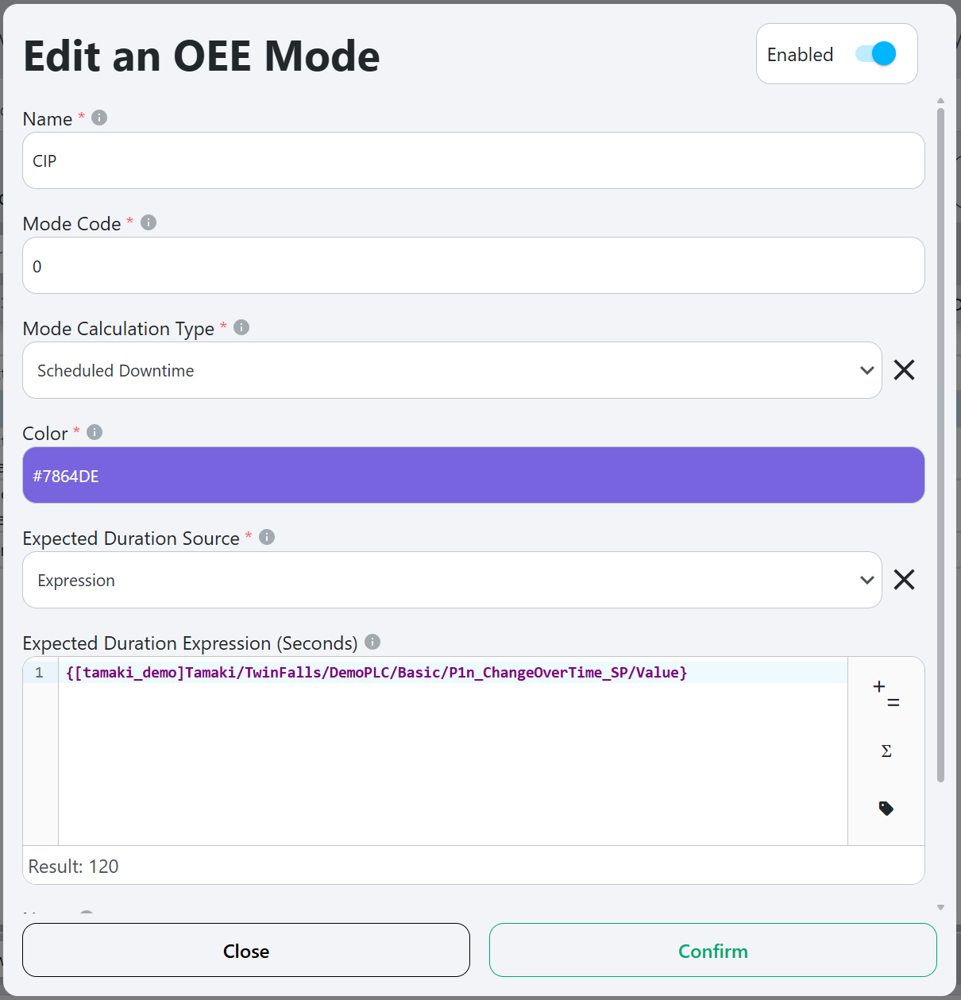
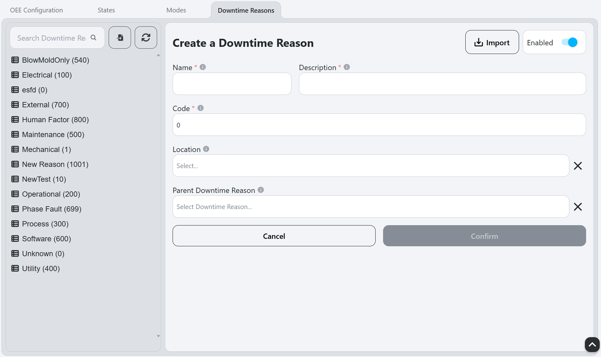

# Setup

**Navigation:**

**Example:**

**Description:**
- The Setup screen allows users to configure the OEE model, including defining [States](#states), [Modes](#modes), [Downtime Reasons](#downtime-reasons), and other [OEE Configurations](#oee-configuration). This screen is essential for customizing the OEE tracking system to fit the specific needs of the manufacturing operation.

**How to use:**
- To populate the [OEE Configurations](#oee-configuration), [States](#states), [Modes](#modes), and [Downtime Reasons](#downtime-reasons) tabs, the user must first select a location from the location tree on the left side of the screen. This selection will determine which configurations are displayed and modified.

## OEE Configuration

**Example:**

### OEE Configuration Workflow

1. Select a location from the dropdown menu to configure OEE settings for that specific location.
2. Set the [Max Record Duration](#max-record-duration) and [Prune Days](#prune-days).
3. Fill out the [Mode Expression](#mode-expression).
4. Configure the [Availability](#availability) settings:
   - [Enable Availability](#enable-availability).
   - Fill out the [State Expression](#state-expression).
   - Configure the [Downtime Reason Source](#downtime-reason-source) and [Downtime Reason Expression](#downtime-reason-expression).
5. Configure the [Performance](#performance) settings:
   - [Enable Performance](#enable-performance).
   - Fill out the [Production Count Unit of Measure](#production-count-unit-of-measure).
   - Fill out the [Production Rate Time Unit](#production-rate-time-unit).
   - Fill out the [Production Count Expression](#production-count-expression).
   - Select the [Production Count Calculation Type](#production-count-calculation-type).
   - Set the [Production Count Overflow Value](#production-count-overflow-value).
   - Configure the [Standard Rate Source](#standard-rate-source) and set the [Standard Rate](#standard-rate-uomtime-unit).
6. Configure the [Quality](#quality) settings:
    - [Enable Quality](#enable-quality).
    - Fill out the [Waste Count Expression](#waste-count-expression).
    - Select the [Waste Count Calculation Type](#waste-count-calculation-type).
    - Set the [Waste Count Overflow Value](#waste-count-overflow-value).
7. Configure the [Production Order Source](#production-order-source).
8. Save the configuration by clicking the `Confirm` button at the bottom of the screen.

### OEE Configuration Fields

#### Export

Exports the OEE configuration for the selected location to an Excel file. This can be useful for backup purposes or for transferring configurations between different instances of Tamaki MES.

#### Delete

Deletes the OEE configuration for the selected location. This will not affect any existing OEE Records at this location, they will remain.

#### Enabled

Toggles the OEE tracking for the selected location.

#### Max Record Duration

Maximum duration for an OEE record in seconds. Normally, the following events cause an OEE record to cut over to the next record:
- OEE Mode change at the location.
- Standard rate change at the location.
- Production order change at the location.
- [future] Operation start or end at the location.
- [future] Shift start or end at the location.

If none of those events occur within the [Max Record Duration](#max-record-duration), the OEE record will end automatically. The purpose of this is to control the granularity of the records. Changing this value will not affect existing records, but will apply to new records created after the change.

#### Prune Days

Number of days to retain OEE records. (If blank, records will be kept indefinitely)

#### [Mode](terms-and-definitions#mode) Expression

The [Expression Field](terms-and-definitions#expression-field) is evaluated to an integer value corresponding to a [Mode](terms-and-definitions#mode)'s code of the location is bound to the OEE model.

#### Availability

##### Enable Availability

Enables availability tracking for the OEE Records. This allows the system to track when the location is running and when it is not, providing insights into the operational efficiency of the equipment.

##### State Expression

The [Expression Field](terms-and-definitions#expression-field) where the PLC tag for the [State](terms-and-definitions#state) of the location is bound to the OEE model.

##### Downtime Reason Source

Opens a dropdown with the following options:
- **Manual:** The downtime reason will be manually selected by the user when a downtime event occurs using the [Downtime Entry](downtime-entry) page.
- **Expression:** The downtime reason will be determined by the [Downtime Reason Expression](#downtime-reason-expression) field.

##### Downtime Reason Expression

The [Expression Field](terms-and-definitions#expression-field) where the PLC tag for the [Downtime Reason](terms-and-definitions#downtime-reason) of the location is bound to the OEE model.

#### Performance

##### Enable Performance

Enables performance tracking for the OEE Records. This allows the system to track the production count and rate of the location.

##### Production Count Unit of Measure

The unit of measure for the [Production Count](terms-and-definitions#production-count). This is used to define how the production count is measured, such as in pieces, kilograms, or liters.

##### Production Rate Time Unit

The time unit for the production rate, such as seconds, minutes, or hours. This is used to define how the production rate is calculated. 

For example, if this field is set to `Minutes`, and the [Production Count Unit of Measure](#production-count-unit-of-measure) is set to `Pound`, then the production rate will be calculated in `Pounds per Minute`.

##### Production Count Expression

The [Expression Field](terms-and-definitions#expression-field) where the PLC tag for the [Production Count](terms-and-definitions#production-count) of the location is bound to the OEE model.

##### Production Count Calculation Type

Opens a dropdown with the following options:
- **Direct:** The production count will be calculated directly from the value in the [Production Count Expression](#production-count-expression) field.
- **Delta:** The production count will be calculated as the difference between the current value and the previous value. This uses the [Production Count Overflow Value](#production-count-overflow-value) to know when the value has rolled over back to 0.

##### Production Count Overflow Value
The tag capturing production count will roll over to 0 when it reaches this value. This is used to calculate the production count when then [Production Count Calculation Type](#production-count-calculation-type) is set to `delta`.

##### Standard Rate Source

Opens a dropdown with the following options:
- **Static:** The standard rate will be a fixed value set in the [Standard Rate](#standard-rate-uomtime-unit) field.
- **Expression:** The standard rate will be determined by the [Standard Rate Expression](#standard-rate-expression-uomtime-unit) field.

##### Standard Rate  ([UoM](#production-count-unit-of-measure)/[Time Unit](#production-rate-time-unit))

The fixed value for the [Standard Rate](terms-and-definitions#standard-rate) of the location, defined in the unit of measure and time unit specified in the [Production Count Unit of Measure](#production-count-unit-of-measure) and [Production Rate Time Unit](#production-rate-time-unit) fields. This is used to define the expected production rate for the location.

##### Standard Rate Expression ([UoM](#production-count-unit-of-measure)/[Time Unit](#production-rate-time-unit))

The [Expression Field](terms-and-definitions#expression-field) where the PLC tag for the [Standard Rate](terms-and-definitions#standard-rate) of the location is bound to the OEE model.

#### Quality

##### Enable Quality

Enables quality tracking for the OEE Records. This allows the system to track the waste count and rate of the location.

##### Waste Count Expression

The [Expression Field](terms-and-definitions#expression-field) where the PLC tag for the [Waste Count](terms-and-definitions#waste-count) of the location is bound to the OEE model.

##### Waste Count Calculation Type

Opens a dropdown with the following options:
- **Direct:** The waste count will be calculated directly from the value in the [Waste Count Expression](#waste-count-expression) field.
- **Delta:**  The waste count will be calculated as the difference between the current value and the previous value. This uses the [Waste Count Overflow Value](#waste-count-overflow-value) to know when the value has rolled over back to 0.

##### Waste Count Overflow Value

The tag capturing waste count will roll over to 0 when it reaches this value. This is used to calculate the waste count when then [Waste Count Calculation Type](#waste-count-calculation-type) is set to `delta`.

#### Production Order

##### Production Order Source

Opens a dropdown with the following options:
- **None:** No production order will be tracked for the location.
- **Expression:** The production order will be determined by the [Production Order Expression](#production-order-expression) field.

##### Production Order Expression

The [Expression Field](terms-and-definitions#expression-field) where the PLC tag for the [Production Order](terms-and-definitions#production-order) of the location is bound to the OEE model.

## States

**Example:**

### State Workflow

#### Create New State
1. Click on the `Create New` button to create a new state.
2. Fill out the fields in the popup that appears (see [Edit or Create New State Popup Fields](#edit-or-create-new-state-popup-fields) for details).
3. Click the `Confirm` button to save the new state.

#### Edit State
1. Select a state from the list on the left side of the screen.
2. Click on the `Edit` button to open the edit popup.
3. Modify the fields in the popup as needed (see [Edit or Create New State Popup Fields](#edit-or-create-new-state-popup-fields) for details).
4. Click the `Confirm` button to save the changes.

### State Fields

#### Delete

Deletes the selected state.

#### Edit

Opens the following popup to edit the selected state (in this case, "Downtime"):

Refer to [Edit or Create New State Popup Fields](#edit-or-create-new-state-popup-fields) for details on the popup.

#### Create New

Opens the following popup to create a new state:

Refer to [Edit or Create New State Popup Fields](#edit-or-create-new-state-popup-fields) for details on the popup.

#### Edit or Create New State Popup Fields

##### Enabled

Toggles the state on or off.

##### Name

The name of the state, and what is displayed in the [Line Graphic](line-overview#line-graphic). This should be a descriptive name that clearly indicates the purpose of the state (e.g., "Running", "Downtime", "Setup").

##### Interruption Location

This is a dropdown that allows the user to select an interruption location.

The interruption location is the location that is causing the state of the selected location to be set to the selected state. 

Here are a few examples of states and their corresponding interruption locations:

- **State is `Downtime`:** The interruption location would be left blank, because downtime doesn't occur as a result of another location.

- **State is `Starved`:** The interruption location would be the location that is directly _before_ the selected location. This is because, for the location to be starved, the location _before_ it in the production line must not be _outputting_ what the selected location needs to run.

- **State is `Blocked`:** The interruption location would be the location that is directly _after_ the selected location. This is because, for the location to be blocked, the location _after_ it in the production line must not be _accepting_ an input from the selected location.

##### State Code

This is the integer code for the state, matching the PLC tag that indicates the state of the location. This code is used to identify the state in the PLC and should be unique for each state.

##### State Calculation Type

This is a dropdown that allows the user to select how the OEE record of the state will be handled. The options are:
- **Idle:** This is the default state for the OEE record, indicating that the location is not currently running or producing anything.
- **Running:** This is the state for the OEE record when the location is actively producing items. This state is counted towards the OEE calculation as running time.
- **Downtime:** This is the state for the OEE record when the location is not producing items due to a planned or unplanned downtime event. 
- **Starved:** This is the state for the OEE record when the location is not producing items because it is waiting for input from a previous location in the production line.
- **Blocked:** This is the state for the OEE record when the location is not producing items because it is waiting for output to be accepted by a subsequent location in the production line.

##### Color

The color associated with the state, used for visual representation in the OEE timeline and [Line Graphic](line-overview#line-graphic).

## Modes

**Example:**

### Mode Workflow

#### Create New Mode
1. Click on the `Create New` button to create a new mode.
2. Fill out the fields in the popup that appears (see [Edit or Create New Mode Popup Fields](#edit-or-create-new-mode-popup-fields) for details).
3. Click the `Confirm` button to save the new mode.

#### Edit Mode
1. Select a mode from the list on the left side of the screen.
2. Click on the `Edit` button to open the edit popup.
3. Modify the fields in the popup as needed (see [Edit or Create New Mode Popup Fields](#edit-or-create-new-mode-popup-fields) for details).
4. Click the `Confirm` button to save the changes.

### Mode Fields

#### Delete

Deletes the selected mode.

#### Edit

Opens the following popup to edit the selected mode (in this case, "CIP"):

Refer to [Edit or Create New Mode Popup Fields](#edit-or-create-new-mode-popup-fields) for details on the popup.

#### Create New

Opens the following popup to create a new mode:

Refer to [Edit or Create New Mode Popup Fields](#edit-or-create-new-mode-popup-fields) for details on the popup.

### Edit or Create New Mode Popup Fields

#### Name

The name of the mode. This should be a descriptive name that clearly indicates the purpose of the mode (e.g. `Idle`, `Production`, `Product Changover`, `Maintenance`).

#### Mode Code

The integer code for the mode, matching the PLC tag that indicates the mode of the location. This code is used to identify the mode in the PLC and should be unique for each mode.

#### Mode Calculation Type

This is a dropdown that allows the user to select how the OEE record of the mode will be handled. The options are:
- **Schedule Production:** This mode is used for scheduled production runs, where the location is expected to produce items according to a predefined schedule.
- **Scheduled Downtime:** This mode is used for planned downtime events, such as maintenance or setup changes, where the location is not expected to produce items.
- **Unscheduled Downtime:** This mode is used for when the location is not planned to be producing items but not due to a planned downtime event. This could be simply idle time between production runs.

#### Color

The color associated with the mode, used for visual representation.

#### Expected Duration Source

Opens a dropdown with the following options:
- **Expression:** The expected duration will be determined by the [Expected Duration Expression](#expected-duration-expression-seconds) field.
- **Static:** The expected duration will be a fixed value set in the [Expected Duration](#expected-duration-seconds) field.

#### Expected Duration Expression (Seconds)

The [Expression Field](terms-and-definitions#expression-field) where the PLC tag for the expected duration of the mode is bound to the OEE model. This allows for dynamic calculation of the expected duration based on real-time data.

#### Expected Duration (Seconds)

The fixed value for the expected duration of the mode, defined in seconds. This is used to set a baseline for how long the mode is expected to last, which can be useful for planning and scheduling purposes.

## Downtime Reasons

**Example:**

### Downtime Reasons Model [oee downtime reason](..%2F..%2Fappendix%2Fdata-model%2Foee-model%2Foee-downtime-reason.md)

### Downtime Reasons Workflow

##### Create New Downtime Reason
1. right-click either on empty space in the tree, or on the downtime reason which you want to use as the parent reason.
2. Click `Add Downtime Reason` in the context menu that appears from right-clicking. This will populate the right side of the screen with empty values, and set the [Parent Downtime Reason](#parent-downtime-reason) to what was right-clicked (see [Edit or Create New Downtime Reason Fields](#edit-or-create-new-downtime-reason-fields)).
3. Fill out the fields on the right side of the screen (see [Edit or Create New Downtime Reason Fields](#edit-or-create-new-downtime-reason-fields) for details).
4. Click the `Confirm` button to save the new downtime reason.

##### Edit Downtime Reason
1. Select a downtime reason from the tree on the left side of the screen. The right side of the screen will be populated with the details of the selected downtime reason.
2. Modify the fields on the right side of the screen as needed (see [Edit or Create New Downtime Reason Fields](#edit-or-create-new-downtime-reason-fields) for details).
3. Click the `Confirm` button to save the changes.

### Downtime Reasons Fields

#### Downtime Reason Tree

The downtime reason tree displays the hierarchy of downtime reasons. It allows users to navigate through the downtime reasons, making it easier to add or edit a downtime reason.

To edit a downtime reason, select it from the tree to populate the right side of the screen. See [Edit or Create New Downtime Reason Fields](#edit-or-create-new-downtime-reason-fields) for details on the fields.

To create a new downtime reason, 

### Edit or Create New Downtime Reason Fields

#### Name

The name of the downtime reason, which is displayed in [Downtime Entry](downtime-entry), [Downtime Records](line-overview#downtime-records), and other places in the MES. This should be a descriptive name that clearly indicates the cause of the downtime.

#### Description

A concise, detailed description of the downtime reason, providing additional context and information about the cause of the downtime. This can help operators and managers understand the issue better and take appropriate actions.

#### Code

The integer code for the downtime reason, matching the PLC tag that indicates the downtime reason of the location. This code is used to identify the downtime reason in the PLC and should be unique for each downtime reason.

#### Parent Downtime Reason

The parent downtime reason, which is used to create a hierarchy of downtime reasons. This allows for categorization and grouping of related downtime reasons, making it easier to analyze and report on downtime events.
