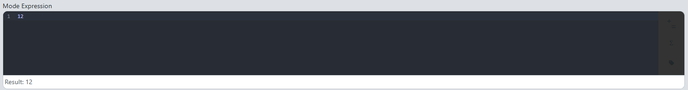
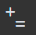
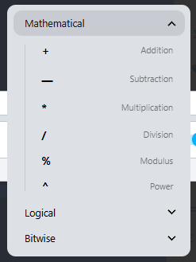
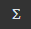
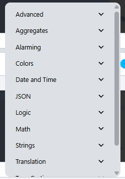
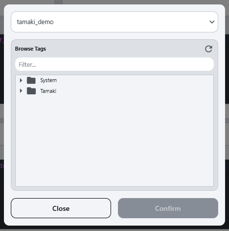
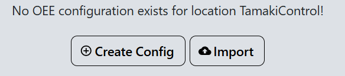
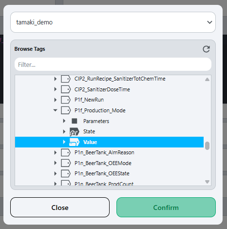
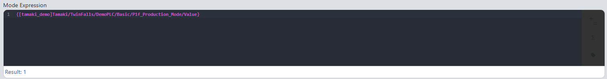

# Terms and Definitions
This document provides definitions and explanations of key terms related to Overall Equipment Effectiveness (OEE) in manufacturing. Understanding these terms is essential for effectively utilizing OEE metrics to improve production processes.

## OEE (Overall Equipment Effectiveness)
- **Definition:** 
  - A measure of how effectively a manufacturing operation is utilized compared to its full potential.
- **Formula**:
```
    OEE = (Availability) x (Performance) x (Quality)
```
- **Components:**
  - [Availability](#availability): The percentage of scheduled time that the equipment is available for production.
  - [Performance](#performance): The speed at which the equipment operates compared to its maximum potential speed.
  - [Quality](#quality): The percentage of products produced that meet quality standards.
- **Purpose:**
  - **Identifies Inefficiencies**: OEE helps pinpoint areas where production processes can be improved, leading to increased efficiency.
  - **Enhances Decision-Making**: By providing real-time data on equipment performance, OEE supports informed decision-making for process improvements.
  - **Drives Continuous Improvement**: OEE encourages a culture of continuous improvement by highlighting performance gaps and tracking progress over time.

## State
- **Definition:** 
  - The current operational status of a piece of equipment or production line.
  - Data model [state](..%2F..%2Fappendix%2Fdata-model%2Foee-model%2Fstate.md), [state record](..%2F..%2Fappendix%2Fdata-model%2Foee-model%2Foee-state-record.md)
- **Purpose:**
  - To indicate whether the equipment is running, stopped, or in a fault condition.

## Mode
- **Definition:** 
  - The operational mode of a piece of equipment, such as running, setup, maintenance, or idle.
  - Data model [mode](..%2F..%2Fappendix%2Fdata-model%2Foee-model%2Fmode.md), [mode record](..%2F..%2Fappendix%2Fdata-model%2Foee-model%2Foee-mode-record.md)
- **Purpose:**
  - To categorize the operational state of equipment based on its current function or activity.

## Availability
- **Definition:** 
  - The percentage of scheduled time that the equipment is available for production.
  - It accounts for downtime due to maintenance, breakdowns, and other interruptions.
- **Formula**:
```
    Availability = (Total Production Time - Downtime) / Total Production Time
```
- **Purpose**:
  - To measure the effectiveness of equipment utilization by identifying periods when it is not available for production.

## Performance
- **Definition:** 
  - The speed at which the equipment operates compared to its maximum potential speed.
  - It identifies losses due to slow cycles or reduced speed.
- **Formula**:
```
    Performance = (Actual Production Rate / Ideal Production Rate)
```
- **Purpose**:
  - To assess how efficiently the equipment is operating relative to its designed capacity.

## Quality
- **Definition:** 
  - The percentage of products produced that meet quality standards.
  - It identifies defects and rework, impacting overall production efficiency.
- **Formula**:
```
    Quality = (Good Units Produced / Total Units Produced)
```
- **Purpose**:
  - To evaluate the effectiveness of the production process in delivering products that meet quality requirements.

## Downtime Reason
- **Definition:** 
  - The specific cause of downtime for a piece of equipment or production line.
  - Data model [downtime reason](..%2F..%2Fappendix%2Fdata-model%2Foee-model%2Foee-downtime-reason.md)
- **Purpose:**
  - To categorize and analyze the reasons for equipment downtime, enabling targeted improvements to reduce future occurrences.

## Production Count
- **Definition:** 
  - The total number of units produced by a piece of equipment or production line during a specific time period.
- **Purpose:**
  - To track production output and measure the efficiency of the manufacturing process.

## Waste Count
- **Definition:** 
  - The total number of units that were produced but did not meet quality standards, resulting in waste.
- **Purpose:**
  - To quantify the amount of waste generated in the production process, helping to identify areas for quality improvement.

## Production Order
TODO
- **Definition:** 
  - A document or system entry that specifies the details of a production run, including the items to be produced, quantities, and timelines.
- **Purpose:**
  - To provide a structured approach to managing production activities, ensuring that resources are allocated efficiently and production goals are met.


## Expression Field

- **Example:**


- **Definition:**
  - An expression field is a customizable input that allows users to attach PLC tags to Ignition variables, and then modify them with calculations using Ignition's [Ignition Expression Language Documentation](https://www.docs.inductiveautomation.com/docs/8.1/platform/expression-language-and-syntax). It can be used to create complex logic for determining states, modes, or other operational parameters.

- **Purpose:**
  - To provide flexibility in defining how data is processed and interpreted within the OEE system, enabling users to tailor the model to their specific operational needs.

- **Components:**
  - **Text Entry Section:**
    - A text input field where users can enter expressions using the [Ignition Expression Language Documentation](https://www.docs.inductiveautomation.com/docs/8.1/platform/expression-language-and-syntax). This section is automatically populated using the tag selector button.
    - Additional logic can be added to the expression field using the [Ignition Expression Language Documentation](https://www.docs.inductiveautomation.com/docs/8.1/platform/expression-language-and-syntax), allowing for complex calculations and logic to be applied to the PLC tag data.
  - **Common Logical Operators Button:** 
    - Opens a dropdown menu with common logical operators that can be inserted into the expression field. Selecting an operator will insert it into the `Text Entry Section` (see [Ignition Expression Language Documentation](https://www.docs.inductiveautomation.com/docs/8.1/platform/expression-language-and-syntax) for more details):
      - 
  - **Common Formulas Button:** 
    - Opens a dropdown menu with options to insert common functions into the expression field. Selecting a function will insert it into the `Text Entry Section` (see [Ignition Expression Language Documentation](https://www.docs.inductiveautomation.com/docs/8.1/platform/expression-language-and-syntax) for more details):
      - 
  - **Tag Selector Button:** 
    - Opens a tag selector popup, allowing users to select a PLC tag to bind to the expression field:
    - 
      1. The top dropdown allows users to select the tag provider, and the tree below allows users to navigate through the tags in the selected provider.
      2. To add a tag to the `Text Entry Section`, either select the tag and click `Confirm`, or just double-click the desired tag.

- **Tutorials:**
  - **Syntax:** Please refer to the [Ignition Expression Language Documentation](https://www.docs.inductiveautomation.com/docs/8.1/platform/expression-language-and-syntax) for detailed information on the syntax of expression fields.
  - **Example workflows:**
    - **Binding the PLC mode tag of a location to track its OEE:**
      1. Navigate to the [OEE Setup](setup) screen.
      2. Select the location from the location tree on the left side of the screen to modify. (if the location does not have an OEE configuration, you will need to create one first by clicking `Create Config` ).
      3. Locate the `Mode Expression` field in the OEE Configuration tab.
      4. Select the tag selector button on the right side of the `Mode Expression` field: 
      5. In the tag selector popup, navigate to the PLC mode tag for the selected location and select it: 
         - 
      6. Click the `Confirm` button to input the PLC mode tag to the `Mode Expression` field.
      7. The tag will now be bound to the OEE model, allowing it to track the mode of the location in real-time:
         - 
  - **TODO:**
    - Add more examples of how to use the expression field in different scenarios.

