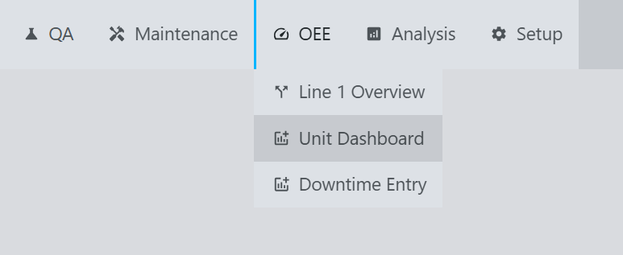
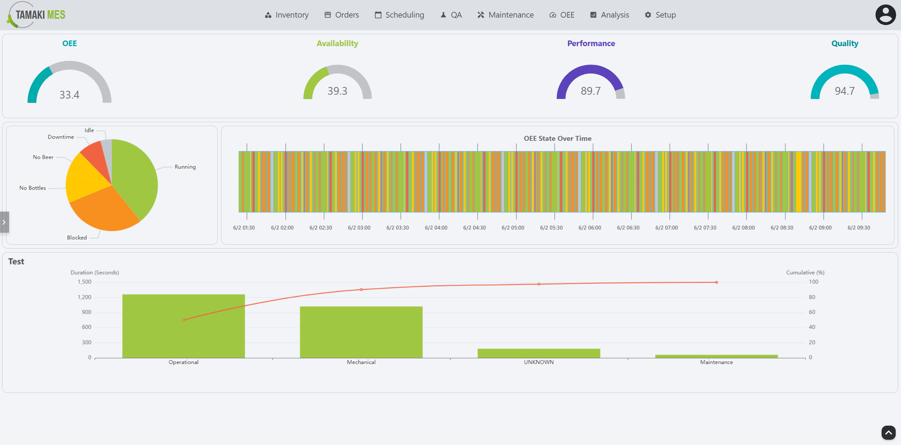

# Unit Dashboard

**Navigation:**

**Example:**

**Description:**
- The Unit Dashboard screen provides a detailed view of the performance and status of individual units within the production line. It allows users to monitor the effectiveness of each unit, track downtime, and analyze performance metrics.
- The dashboard includes:
  - **Unit Performance Metrics**: Displays OEE metrics for each unit, including availability, performance, and quality.
  - **Downtime Records**: Lists downtime events specific to the unit, including reasons and durations.
  - **Historical Data**: Provides a timeline of the unit's performance over time, allowing users to identify trends and patterns.