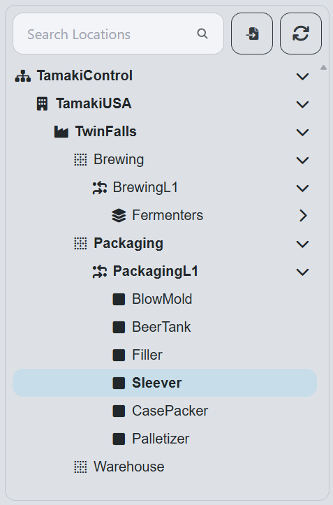

# Unit Dashboard

**Navigation:**

**Example:**

**Description:**
- The Unit Dashboard screen provides a detailed view of the performance and status of individual units within the production line. It allows users to monitor the effectiveness of each unit, track downtime, and analyze performance metrics.

**Components:**
- [Top Bar](#top-bar)
- [Charts](#charts)
- [OEE State Timeline](#oee-state-timeline)
- [OEE Mode Timeline](#oee-mode-timeline)
- [OEE Metrics by Hour](#oee-metrics-by-hour)
- [Downtime Reasons Pareto Chart](#downtime-reasons-pareto-chart)
- [Performance Details](#performance-details)
- [Quality Details](#quality-details)
- [Time Selection Sidebar](#time-selection-sidebar)

## Top Bar
**Example:**

**Description:**
- The top bar of the Unit Dashboard displays key information about the selected unit, including:
  - **OEE**: Refer to [OEE](terms-and-definitions#oee-overall-equipment-effectiveness) for details on how OEE is calculated.
  - **Availability**: Refer to [Availability](terms-and-definitions#availability) for details on how availability is calculated.
  - **Performance**: Refer to [Performance](terms-and-definitions#performance) for details on how performance is calculated.
  - **Quality**: Refer to [Quality](terms-and-definitions#quality) for details on how quality is calculated.

## Charts
**Example:**

**Description:**
- **States Bar Chart**: Displays the total duration of each [state](setup#states) using vertical bars.

- **Modes Bar Chart**: Shows the time spent in different [modes](setup#modes) using vertical bars

- **Combined Bar Chart**: Merges both state and mode information into a single bar chart.

- **Combined Pie Chart**: Provides a visual representation of the time distribution among various states and modes. The chart is color-coded to match the modes defined in the [Modes](setup#modes) section and the states defined in the [States](setup#states) section.

## OEE State Timeline
**Example:**

**Description:**
- A timeline that shows the historical OEE state of the line, allowing users to see trends and patterns over time. Hover over the colored bars that make up the timeline to see the [State](setup#states) and duration of the event as well as either the source location and reason depending on the state.
- Clicking on a bar in the timeline will open a popup with more detailed information about the event:
  
  
  
## OEE Mode Timeline
**Example:**

**Description:**
- A timeline that shows the historical OEE mode of the line, allowing users to see trends and patterns over time. Hover over the colored bars that make up the timeline to see the [Mode](setup#modes) and duration of the event.

## OEE Metrics by Hour
**Example:**

**Description:**
- The OEE Metrics by Hour section provides a detailed breakdown of OEE metrics for each hour of the day. This allows users to analyze performance trends and identify specific time periods where performance may have been affected.

## Downtime Reasons Pareto Chart
**Example:**

**Description:**
- The Downtime Reasons Pareto chart displays the most common reasons for downtime in the selected unit. Along with the cumulative frequency, This helps users identify recurring issues and prioritize improvements to reduce downtime. This chart defaults to showing the top level reason codes in the hierarchy, click on any bar to drill down.

## Performance Details  
**Example:**  

  

**Description:**  
- The Performance Details summarizes key production performance metrics for the selected period. It includes values such as Loss %, Total Out, True Rate, Average Rate, and Maximum Rate, all measured in pieces per hour.  These metrics help users evaluate how efficiently the equipment is performing compared to its expected rate and highlight areas where performance losses may be occurring.  

## Quality Details  
**Example:**  

  

**Description:**  
- The Quality Details section provides a breakdown of production quality metrics, including Good Count and Total Count in pieces. This view helps users assess the quality efficiency of the process by comparing the number of acceptable (good) products against total production. Monitoring these values helps identify quality-related losses and supports continuous improvement efforts.

## Time Selection Sidebar
**Example:**

**Description:**
- The Time Selection sidebar allows users to select the time range for which they want to view data on the Unit Dashboard. Users can choose from predefined ranges or specify a custom range to analyze performance metrics and downtime reasons for specific periods.

### Components

- **Time Range Selection**: The user can select between realtime and historical data.
  - **Realtime**: The user can select a duration, time unit (hours, minutes, or seconds), and a refresh interval.

  - **Historical**: The user can select a start and end date to view historical data.

  - **Shift**: The user can define a time range in weeks and select a specific shift from the available options within that range.

- **Location Selection Tree**: 
  - The user can select a specific location to filter the data displayed on the dashboard. The tree structure allows for easy navigation through the hierarchy of locations.

