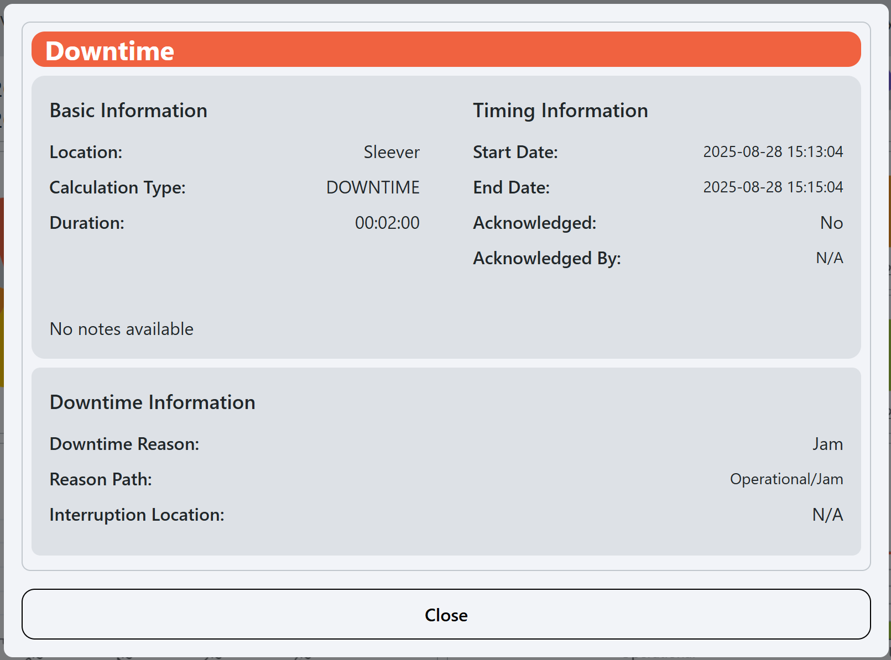
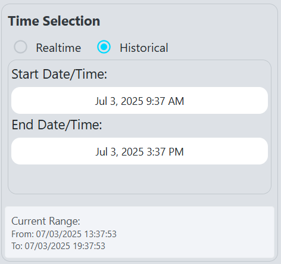

# Unit Dashboard

**Navigation:**

**Example:**

**Description:**
- The Unit Dashboard screen provides a detailed view of the performance and status of individual units within the production line. It allows users to monitor the effectiveness of each unit, track downtime, and analyze performance metrics.

**Components:**
- [Top Bar](#top-bar)
- [Pie Chart](#pie-chart)
- [OEE State Timeline](#oee-state-timeline)
- [OEE Metrics by Hour](#oee-metrics-by-hour)
- [Downtime Reasons Pareto Chart](#downtime-reasons-pareto-chart)
- [Performance Details Chart](#performance-details-chart)
- [Quality Details Chart](#quality-details-chart)
- [Time Selection Sidebar](#time-and-location-selection-sidebar)

## Top Bar
**Example:**

**Description:**
- The top bar of the Unit Dashboard displays key information about the selected unit, including:
  - **OEE**: Refer to [OEE](terms-and-definitions#oee-overall-equipment-effectiveness) for details on how OEE is calculated.
  - **Availability**: Refer to [Availability](terms-and-definitions#availability) for details on how availability is calculated.
  - **Performance**: Refer to [Performance](terms-and-definitions#performance) for details on how performance is calculated.
  - **Quality**: Refer to [Quality](terms-and-definitions#quality) for details on how quality is calculated.

## Pie Chart
**Example:**

**Description:**
- The pie chart provides a visual representation of the different modes of the unit, with the exception that the mode, `Production`, is broken down into its states. The reason that this image seems to be showing only states is because the only mode present in the time frame of this screenshot is `Production`. allowing users to quickly assess the distribution of time spent in each state and mode. The chart is color-coded to match the states and modes defined in the [States](setup#states) and [Modes](setup#modes) sections .

## OEE State and Mode Timelines
**Example:**

**Description:**
- Timelines that shows the historical OEE state and mode of the line, allowing users to see trends and patterns over time. Hover over the colored bars that make up the timeline to see the start time, end time, and duration of the event associated with the color (see [States](setup#states) for what state each color represents).
- Clicking on a bar in the state timeline will open a popup with more detailed information about the event:
  
  
  
## OEE Metrics by Hour
**Example:**

**Description:**
- The OEE Metrics by Hour section provides a detailed breakdown of OEE metrics for each hour of the day. This allows users to analyze performance trends and identify specific time periods where performance may have been affected.

## Downtime Reasons Pareto Chart
**Example:**

**Description:**
- The Downtime Reasons Pareto chart displays the most common reasons for downtime in the selected unit. Along with the cumulative frequency, This helps users identify recurring issues and prioritize improvements to reduce downtime. This chart defaults to showing the top level reason codes in the hierarchy, click on any bar to drill down.

## Performance Details Chart
**Example:**

**Description:**
- The Performance Chart displays the actual performance of the unit compared to the target performance over time.

## Quality Details Chart
**Example:**

**Description:**
- The Quality Chart displays the actual quality of the unit compared to the target quality over time.

## Time and Location Selection Sidebar
**Example:**

**Description:**
- The Time and Location Selection sidebar allows users to select the time range for which they want to view data on the Unit Dashboard, as well as the location they want view data for. Users can choose from predefined ranges or specify a custom range to analyze performance metrics and downtime reasons for specific periods.

### Components  

- **Time Range Selection**: The user can select between realtime and historical data.
  - **Realtime**: The user can select a duration, time unit (hours, minutes, or seconds), and a refresh interval.

  - **Historical**: The user can select a start and end date to view historical data.

- **Location Selection Tree**: 
  - The user can select a specific location to filter the data displayed on the dashboard. The tree structure allows for easy navigation through the hierarchy of locations.

