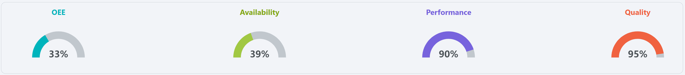

# Unit Dashboard

**Navigation:**

**Example:**

**Description:**
- The Unit Dashboard screen provides a detailed view of the performance and status of individual units within the production line. It allows users to monitor the effectiveness of each unit, track downtime, and analyze performance metrics.

**Components:**
- [Top Bar](#top-bar)
- [Pie Chart](#pie-chart)
- [OEE State Timeline](#oee-state-timeline)
- [OEE Metrics by Hour](#oee-metrics-by-hour)
- [Top Downtime Reasons](#top-downtime-reasons)

## Top Bar
**Example:**

**Description:**
- The top bar of the Unit Dashboard displays key information about the selected unit, including:
  - **OEE**: Refer to [OEE](terms-and-definitions#oee-overall-equipment-effectiveness) for details on how OEE is calculated.
  - **Availability**: Refer to [Availability](terms-and-definitions#availability) for details on how availability is calculated.
  - **Performance**: Refer to [Performance](terms-and-definitions#performance) for details on how performance is calculated.
  - **Quality**: Refer to [Quality](terms-and-definitions#quality) for details on how quality is calculated.

## Pie Chart
**Example:**

**Description:**
- The pie chart provides a visual representation of the different states of the unit, allowing users to quickly assess the distribution of time spent in each state. The chart is color-coded to match the states defined in the [States](setup#states) section.

## OEE State Timeline
**Example:**

**Description:**
- A timeline that shows the historical OEE state of the line, allowing users to see trends and patterns over time. Hover over the colored bars that make up the timeline to see the start time, end time, and duration of the event associated with the colour (see [States](setup#states) for what state each color represents).
- Clicking on a bar in the timeline will open a popup with more detailed information about the event:
  - 
  
## OEE Metrics by Hour
**Example:**

**Description:**
- The OEE Metrics by Hour section provides a detailed breakdown of OEE metrics for each hour of the day. This allows users to analyze performance trends and identify specific time periods where performance may have been affected.

## Top Downtime Reasons
**Example:**

**Description:**
- The Top Downtime Reasons chart displays the most common reasons for downtime in the selected unit. This helps users identify recurring issues and prioritize improvements to reduce downtime.

