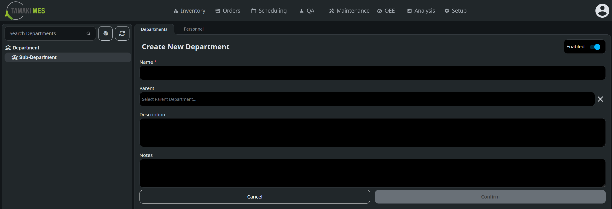
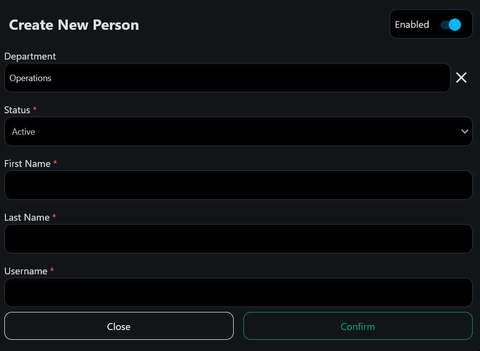
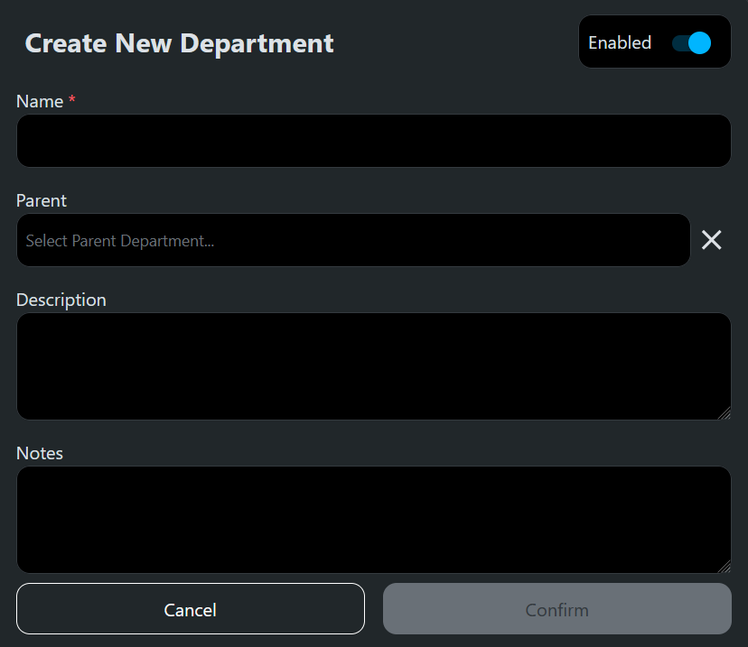

# Setup

In the MES, a [Person](../../appendix/data-model/personnel-model/personnel.md) represents an individual user who
interacts with the system. This entity includes personal details such as name, username, and initials, as well as
employment status and certifications. A [Department](../../appendix/data-model/personnel-model/personnel-department.md) is 
an organizational group within the company. Each department has a unique name and can have child departments, forming a
hierarchical structure.

The main view of the personnel configuration screen has two tabs, one for managing persons and another for managing 
departments. The personnel tab has a table listing all people in the system and includes their names, usernames, 
departments, and employment status. In the top right corner of the table are buttons for creating, editing, and deleting 
persons. The department tab has a form for creating and editing departments. On both tabs are buttons for importing 
and exporting personnel and departments via CSV or JSON files.

On the left side of the screen is a sidebar that contains the department tree. If the personnel tab is open, selecting 
a department in the tree filters the people shown in the table. If the department tab is open, selecting a department 
loads that department's details into the form for editing. Tree nodes can be expanded and collapsed, and the search bar 
can be used to locate specific departments.

## Creating a Person

To create a new person, navigate to the Personnel tab and click the `Create New` button in the top right corner of the 
personnel table. This will open the Create New Person dialog with fields for entering the person's details.

- **First Name**: The person's first name. This is a required field.
- **Last Name**: The person's last name. This is a required field.
- **Username**: The username the person. This is a required field and must be unique.
- **Department**: The department the person belongs to. This is a required field and can be selected from the dropdown
- **Status**: The person's employment status. Options are Active, Inactive, On Leave, Suspended, Terminated, Retired, 
On Training, Temporary, and Pending Approval.

## Creating a Department

To create a new department, navigate to the Departments tab, right-click the department tree, and select 
`Add Department`. Right-clicking an existing department will create a new child department. This will load the Create
New Department form with fields for entering the department's details.

- **Name**: The department's name. This is a required field and must be unique within its parent department.
- **Parent**: The parent department. If creating a top-level department, this field can be left blank.
- **Description**: A description of the department.
- **Notes**: Additional notes about the department.