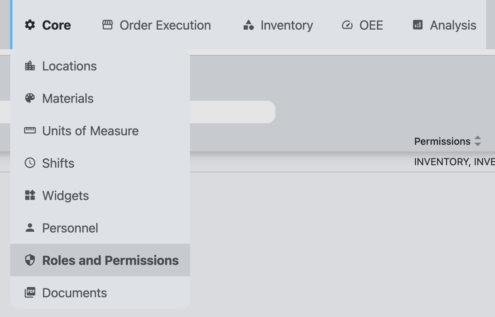
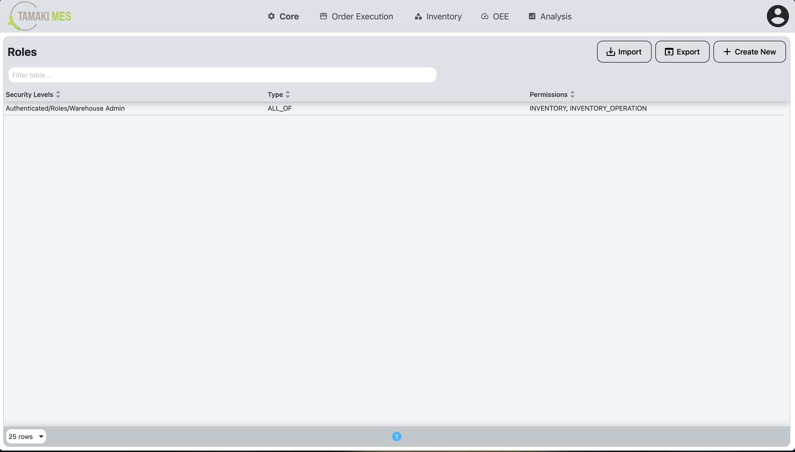
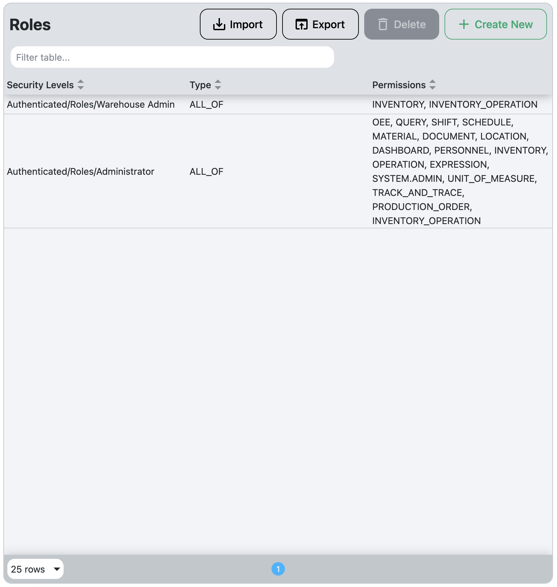
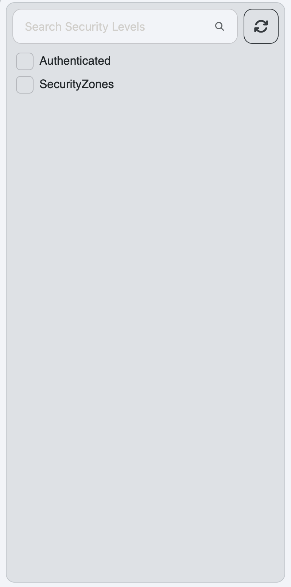
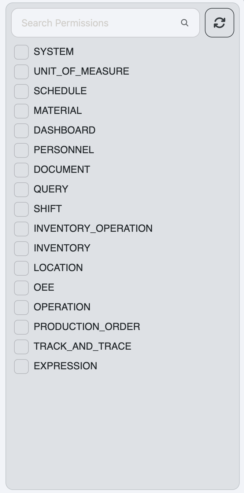
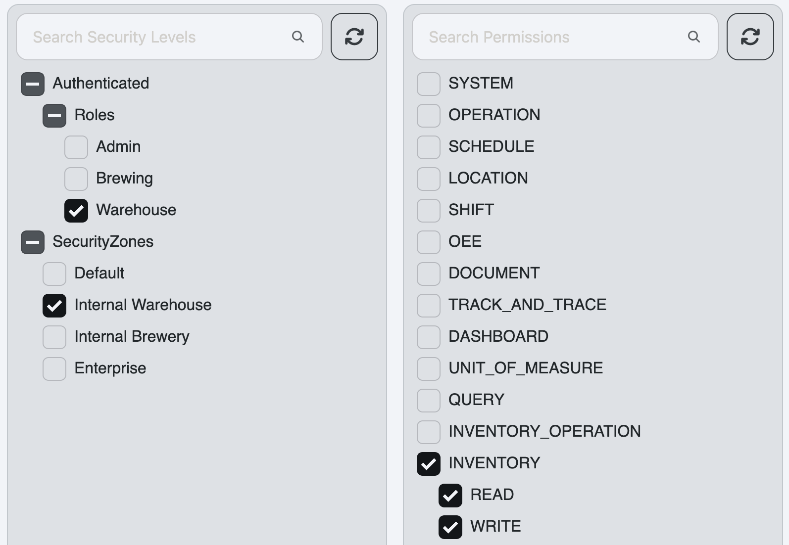
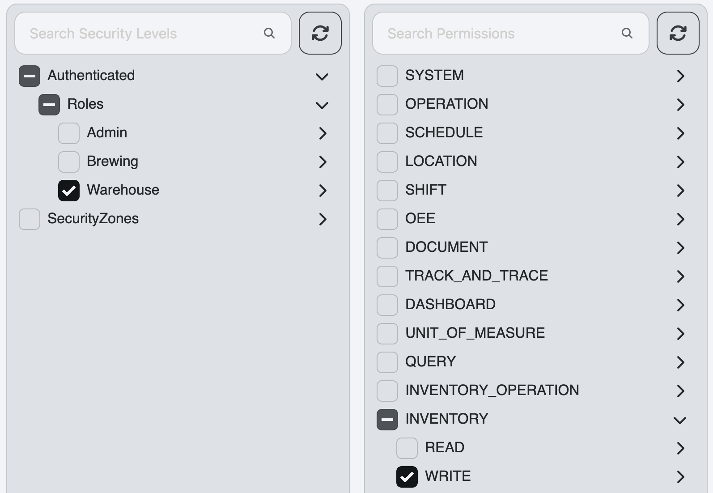

# Roles and Permissions Setup

**Navigation:**

**Example:**

**Description:**

- The Roles and Permissions screen allows administrators to manage roles and their associated permissions within TamakiMES. This is crucial for controlling user access to various features and functionalities based on their assigned roles.

**Components:**

- [Roles and Permissions Setup](#roles-and-permissions-setup)
  - [Roles Table](#roles-table)
  - [Security Levels Tree](#security-levels-tree)
  - [Permissions Tree](#permissions-tree)
  - [Creating or Editing a Personnel Role](#creating-or-editing-a-personnel-role)

## Roles Table

**Example:**

**Description:**

- The Roles Table displays all the Personnel Roles that have been created within TamakiMES. Each Personnel Role has associated Security Levels and Permissions that define what actions users with that role can perform. They also have a Type that indicates whether the user needs to have all or any of the associated Security Levels to be granted the permissions.
- The table can be modified by clicking on a row to edit an existing role or by clicking the "Create New" button to create a new role.
- The table can be sorted by clicking on the column headers, and it can be filtered using the search bar at the top left of the table.
- Personnel Roles can be deleted by selecting one or more rows and clicking the delete button (trash can icon) at the top right of the table.

**Columns:**

- **Security Levels:** The Security Levels associated with the Personnel Role. These are mapped from Ignition and determine which users are assigned to this role based on their Security Levels in Ignition.
- **Type:** Indicates whether the user needs to have all or any of the associated Security Levels to be granted the permissions.
- **Permissions:** The Permissions associated with the Personnel Role. These define what actions users with this role can perform within TamakiMES.

## Security Levels Tree

**Example:**

**Description:**

- The Security Levels Tree displays the hierarchical structure of Security Levels that are defined in Ignition. Administrators can select one or more Security Levels. These selected Security Levels will be associated with the Personnel Role being created or edited. Users who have these Security Levels in Ignition will be assigned to this Personnel Role in TamakiMES.
- Security Zones can also be seen in this tree as they are functionally a subset of Security Levels.
- Security Levels can be edited in the Ignition gateway under the Config > Security > Security Levels section. More information can be found in the [Ignition Security Levels Documentation](https://www.docs.inductiveautomation.com/docs/8.1/platform/security/identity-provider-authentication-strategy/security-levels).

## Permissions Tree

**Example:**

**Description:**

- The Permissions Tree displays the hierarchical structure of Permissions that are defined within TamakiMES. Administrators can select one or more Permissions. If a permission is selected, the user will be granted that permission, as well as any child permissions that fall under it in the hierarchy.
- All TamakiMES features and functionalities are controlled by permissions, so it is crucial to assign the appropriate permissions to ensure users have the necessary access based on their responsibilities.

## Creating or Editing a Personnel Role

- To create a new Personnel Role, click the "Create New" button above the Roles Table. To edit an existing role, click on the desired row in the Roles Table.
- In the panel that appears, select the desired Security Levels from the Security Levels Tree and the desired Permissions from the Permissions Tree.
- Choose the Type for the role, either "All" (the user must have all selected Security Levels to be granted the permissions) or "Any" (the user must have at least one of the selected Security Levels to be granted the permissions). 
- Click the "Save" button to save
  the Personnel Role. The new or updated role will now appear in the Roles Table and will be effective immediately for users who have the associated Security Levels in Ignition.

  **Example:**

  - Let's imagine we want to create the appropriate Personnel Role(s) for Warehouse users. We have the following requirements:
    - Users must have the "Warehouse" role in Ignition.
    - Users in the "Internal Warehouse" Security Zone should be able to read/write inventory data.
    - Other users in the "Warehouse" role but outside the "Internal Warehouse" Security Zone should only have read access to inventory data.
  - To achieve this, we would create two Personnel Roles:
    - 
    - This role requires users to have both the "Warehouse" role and be in the "Internal Warehouse" Security Zone. It grants them read and write permissions for inventory data.
    - 
    - This role requires users to have the "Warehouse" role but does not require them to be in the "Internal Warehouse" Security Zone. It only grants them read permissions for inventory data.
  - With these two Personnel Roles created, users will be granted the appropriate permissions based on their Security Levels in Ignition.
