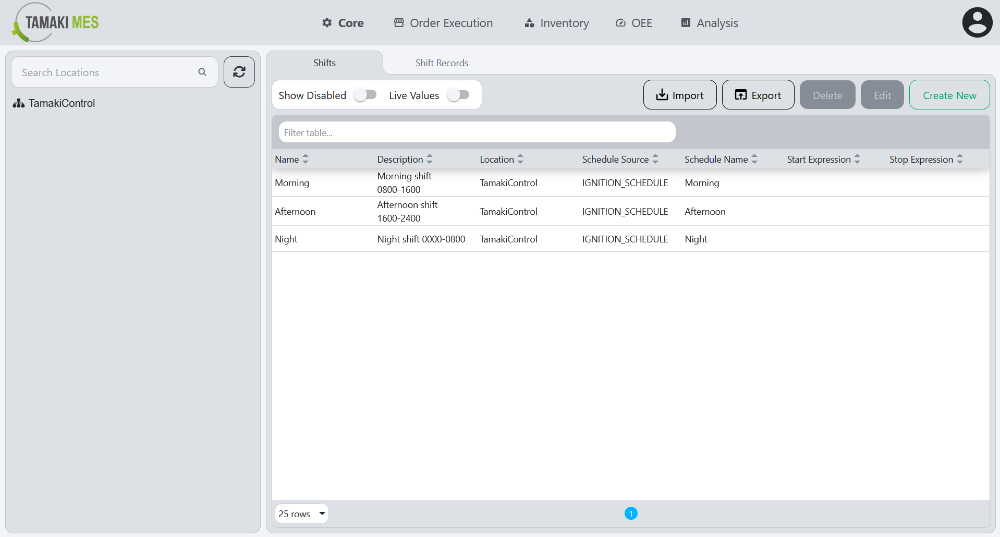
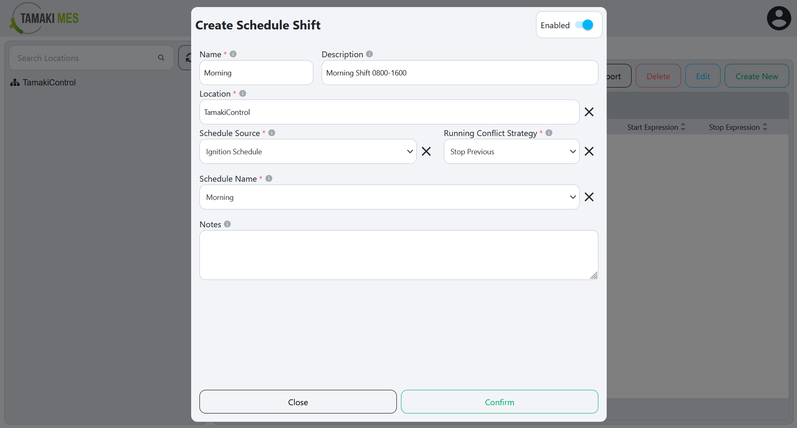
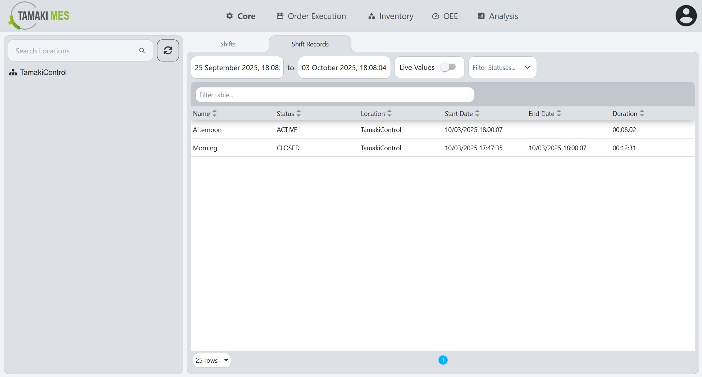

import setupNavigation from './images/setup-navigation.webm';
import setupGateway from './images/setup-gateway.webm';

# Setup

**Navigation:**

<video controls style={{ width: '50vw', borderRadius: '0.5rem' }}>
  <source src={setupNavigation}/>
</video>

**Shifts Landing Page:**

**Description:**

- The [Shifts](#shifts) screen allows users to configure and manage shift definitions for the system. From here, users can define working shifts that determine production schedules across the application.

## Shifts

**Setting up schedules in the Ignition Gateway:**

<video controls style={{ width: '50vw', borderRadius: '0.5rem' }}>
  <source src={setupGateway}/>
</video>

**Creating A Shift With Ignition Schedule:**

**Creating A Shift With Ignition Expression:**

### Shifts Workflow

1. Click the `Create New` button at the top right of the screen. This will open a schedule shift popup.
2. Set the [Name](#name), [Description](#description) and the [Location](#location).
3. Set the [Schedule Source](#schedule-source) and the [Running Conflict Strategy](#running-conflict-strategy).
4. Based on the [Schedule Source](#schedule-source) configuration:
   - Ignition Schedule: Set the [Schedule Name](#schedule-name) from the options made in the Ignition Gateway.
   - Ignition Expression: Set the [Trigger Type](#trigger-type) and the [Trigger Expression](#trigger-expression) for start/stop.
5. Set the [Notes](#notes).
6. Save the configuration by clicking the `Confirm` button at the bottom of the screen.

### Shifts Configuration Fields

#### Enabled

Toggles whether the shift is active. When enabled, the shift is used in scheduling for the associated location. Disabling a shift removes it from active scheduling without deleting its configuration, allowing it to be re-enabled later if needed.

#### Name

The name of the shift. This should be a descriptive name that clearly indicates the purpose of the shift (e.g., "Morning", "Afternoon", "Evening").

#### Description

Provides additional details about the shift, such as its purpose, operating hours, or any special notes relevant to scheduling. This helps distinguish similar shifts and gives operators more context (e.g. “Morning Shift 0800–1600”, "Afternoon Shift 1600-0000", "Evening Shift 0000-0800").

#### Location

Specifies the location where the shift applies. This determines which part of the operation the shift configuration will affect.

#### Schedule Source

Determines how the shift’s active schedule is defined. You can either select an existing Ignition Schedule or use a custom Ignition Expression to control when the shift starts and stops.

#### Running Conflict Strategy

Defines how the system should handle situations when multiple shifts are scheduled to run at the same time for the same location. This ensures that only the appropriate shift is active according to your scheduling rules. You can either select Stop Previous or Throw Exception.

#### Schedule Name  
*Shown when Schedule Source is set to **Ignition Schedule***

Specifies the name of the Ignition Schedule that defines when the shift is active. The available options come from schedules that have been set up in the Ignition Gateway. Selecting the correct schedule ensures the shift runs according to the predefined calendar rules.

#### Trigger Type  
*Shown when Schedule Source is set to **Ignition Expression***

Defines how the system interprets changes in the expression to determine when the Start and Stop triggers occur for the shift. For each trigger, you can choose from:

   - **Rising Edge:** Triggers when the expression transitions from false to true.
   - **Falling Edge:** Triggers when the expression transitions from true to false.
   - **Change:** Triggers whenever the expression value changes, regardless of direction.

#### Trigger Expression  
*Shown when Schedule Source is set to **Ignition Expression***

A custom Ignition Expression is used to define when the shift starts and stops. The Start Expression determines the condition that initiates the shift, while the Stop Expression defines when the shift ends.

#### Notes

A field for adding any relevant comments or additional information about the shift. This can include operational notes, exceptions, or special instructions for personnel.

## Shift Records

**Navigation:**

**Shift Records Landing Page:**

**Description:**

- The [Shift Records](#shift-records) tab provides a read-only view of historical shift data, enabling users to review and sort past records by date without modifying them.