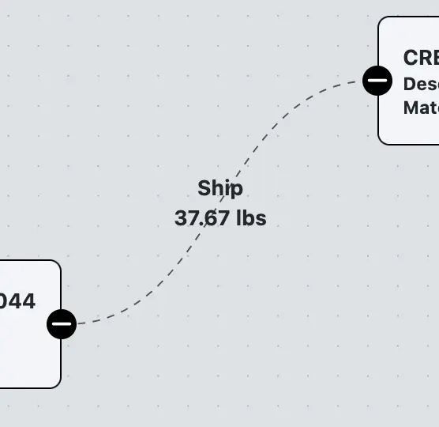

# Terms and Definitions

This document provides definitions and explanations of key terms related to the Track and Trace system. Understanding these terms are essential for effectively using the Track and Trace features.

## Key Terms

- **Lot**: A [lot](../../appendix/data-model/inventory-model/inventory-lot.md) is a specific quantity of material or product that is identified by a unique lot number. Lots are used to track the production, processing, and distribution of materials within the inventory system. Lots are represented as **nodes** in the Track and Trace graph view
  

- **Inventory Transaction (Lot Record)**: An inventory transaction, also known as a lot record, represents a movement or transformation of a lot within the inventory system. This can include actions such as production, consumption, shipping, receiving, and manual adjustments. Inventory transactions are represented as **edges** connecting lots (nodes) in the Track and Trace graph view
  

- **Ancestor Lot**: An ancestor lot is a lot that is upstream in the production or supply chain relative to a selected lot. Ancestor lots are those that contributed to the creation or processing of the selected lot.

- **Descendant Lot**: A descendant lot is a lot that is downstream in the production or supply chain relative to a selected lot. Descendant lots are those that were created or processed using the selected lot.

- **Terminal Node**: A terminal node is a lot that does not have any further descendant lots in the Track and Trace graph. Terminal nodes represent the endpoints of a lot's lineage within the inventory system.

- **Graph View**: The Graph View is a visual representation of the
  relationships between lots in the inventory system. It displays lots as nodes and inventory transactions as edges, allowing users to explore the lineage and connections of a selected lot.

- **Table View**: The Table View provides a tabular representation of the relationships between lots in the inventory system. It lists inventory transactions related to a selected lot, including details such as source/destination lots, quantities, dates, and transaction types.

- **Terminal Nodes View**: The Terminal Nodes View provides tabular information about the terminal nodes (i.e., the most distant descendant lots) related to a selected lot in the inventory system. This view allows users to quickly identify and analyze the end products or lots that have been derived from the selected lot.

- **Depth**: Depth refers to the number of connections (edges) to traverse in the Track and Trace graph when searching for ancestor or descendant lots. A greater depth allows users to explore more distant relationships in the lot lineage.

- **Direction**: Direction indicates whether the Track and Trace search is focused on ancestor lots (upstream) or descendant lots (downstream) relative to the selected lot.
